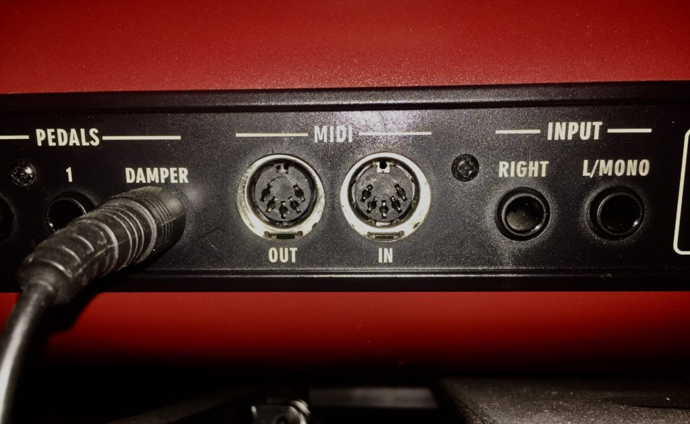
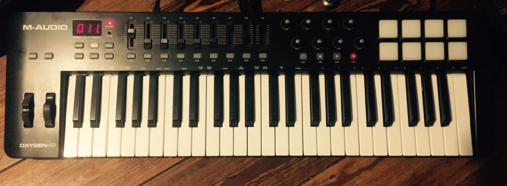

Sometime in my first couple weeks at Berklee I saw a poster that said, “Midi is for people with no friends. Come to Jam Club!”, and I thought, "Midi must be for me."
But little did the jerks at jam club know, with midi you can control a whole kaleidoscope of sound with looper pedals, drum triggers, software synths, or entire sampled orchestras.
At some point you might have heard some fake, computer-y sounding music described as “Sounding like midi.” <strong>The phrase, "sounds like midi" is impossible. </strong> You cannot sound like midi fore <strong>MIDI HAS NO SOUND!</strong>

<h3 > Midi ≠ Audio.</h3>

Midi is a <em>programming standard or "protocol" </em>a bunch of manufacturers agreed upon in the 80s to trigger sounds (among other things) so instruments made by different manufacturers could be networked together, a <strong>M</strong>usical <strong>I</strong>nstrument <strong>D</strong>igital <strong>I</strong>nterface, if you will. Midi's uses have snowballed since then.

To get you oriented let's break it down starting from today, work our way around to some of the different things you can do with midi.

Here's where most people today come to find about midi. You have a computer. You want to make music. So you download a DAW, create an "instrument track", load up a patch and "draw" a rectangle. You press play, the computer goes across the rectangle, boom, you hear a sound. It might have gone something like this.

<iframe src="https://www.youtube.com/embed/IJk4O6FnpIs?html5=1" width="560" height="315" frameborder="0" allowfullscreen="allowfullscreen"></iframe>

The sound you are hearing is <strong>not</strong> <strong>the midi</strong>, the sound comes from the <strong>virtual instrument</strong><strong>. </strong>An "instrument track" is actually two different things. It's a track that records and stores midi data <em>and</em> it is also a host for your virtual instrument (VI) that <em>interprets</em> the midi data on the track. The rectangle on the track is a <em>graphical representation</em> of the midi data that will tell your virtual instrument how to behave. When you press play and your computer reaches the left side of the rectangle your VI gets a "Note On" midi message, when the computer reaches the end of the rectangle on the right side, your VI receives a "Note Off" midi message.

These midi regions and the little midi rectangles inside them, "midi notes", can tell your instrument/sampler what note to play, how loud to play, they can send a message to trigger some modifier (like a filter), add a sustain pedal, or do whatever else the instrument/sampler can do with midi messages. You can edit all of that midi info inside your DAW's midi editor. Because midi messages are standardized you can take midi data you made for a violin track and copy it over to a virtual synth track, your synth will trigger the same midi notes and boom, both virtual instruments are playing the same part together, Viosynth.

<h3 > <strong>Performing with Midi
</strong></h3>

If you are a musician you don't have to draw midi, you can record midi data into your DAW with a midi controller. There are an assortment of instrument shaped midi controllers to choose from (keyboards, drum sets, saxophones breath controllers, guitars, ect.) that can make recording midi feel like you are playing an instrument. The beauty in midi is, once the notes are in the computer, you can edit them to change the performance or copy them to another track to trigger any other sampler or virtual instrument you choose. You could make guitar melodies with a saxophone midi controller or vice versa.

If this is making sense you can start to see the possibilities. If you are a guitar player, you can get yourself a guitar midi controller and shred with whatever sound you want. You could record a bunch of farts, put them into a sampler and instantly turn your electric guitar into an<strong> electric fart guitar</strong>. You play a note on your guitar, it sends a midi note message to your computer, the computer sends the midi data to your sampler (which is filled with farts), the sampler outputs the audio fart that is assigned to that midi note. Magical.

<h4 >Once you have midi, you have the world.</h4>

Much more common (and slightly more practical) is to record piano with midi. Recording a live piano with microphones is very difficult and not very flexible so a lot of people record midi for their piano parts. Once you finish recording the performance, you might decide that you would prefer a Fender Rhodes sound rather than a Steinway. No problem. Just change the instrument on your track and you have the exact same performance on a new sound. Want some bass on there? No problem. Copy the midi data of the piano performance to a new track with a bass sound on it, mute out all the high notes and keep in the bass notes. You got yourself a stew going. Now you instantly have a bass track that plays perfectly along with the piano. So it makes sense why midi is also great for people with no friends.

This is only the tip of the iceburg of midi's potential.

<h4><strong>What if you have an old analog synth but you can't play it for crap? Midi is the only friend you need.</strong></h4>

Check the back of your synth for a midi port that looks like this.

Back in 1983, when midi first came out, these ports along with midi cables is how devices transmitted midi. These days, most midi is transmitted over USB cables. So here's how you can use your modern computer to play that vintage synth for you.

<!-- TODO: CHANGE GUITAR CENTER TO AMAZON AFFILIATE -->

Create a midi track and a midi part for your synth to play inside your DAW. You need some kind of midi interface so you can go out of the USB port on your computer and into the standard midi port your synth has. This is <a href="http://www.guitarcenter.com/Roland/UM-ONE-MK2-USB-MIDI-Interface.gc" target="_blank" rel="noopener noreferrer">this the midi interface I use</a> for this. You send the midi out of the computer and into your analog synth, triggering the sound of that sweet, sweet analog warmth. To record the analog synth into your computer, hook up an audio cable (1/4 guitar cable or mic cable depending on what the synth has) out of the synth and route it back into one of your audio interface's inputs. (This can be tricky, there may be some issues with the timing you need to figure out, but I just want you give you a sense of the potential). Depending on how far you are into learning about audio production that may or may not really make sense. Don't worry about it now, just know that there are old school midi cables but they can still be utilized in modern production.

<h3 >Midi Can Control Your DAW</h3>

Earlier I mentioned "instrument shaped midi controllers". There are also all sorts of faders, knobs, buttons, pads, and touch screen based midi controllers too. Here is a (crappy)picture of my M-Audio Oxygen 49 with a bunch of controller options.

You can use those faders to, well, fade stuff. Things like pitch-bend don't really benefit from an on/off type message playing a keyboard key would send. Pitch-bend needs to be controlled gradually up and down and this is done with midi data points in a range from 0 to 127. Guess what else could benefit from these type of midi messages? Your DAW's software faders.

If you are user of Ableton Live then you have probably noticed a Midi button in the top right corner. Watch what happens when I click it, click a track, and then move a physical fader on my Oxygen 49.

<iframe src="https://www.youtube.com/embed/1Fa0wTIyyJw?html5=1" width="560" height="315" frameborder="0" allowfullscreen="allowfullscreen"></iframe>

Viola ;) I now can control this track's virtual fader by moving a physical fader on my Oxygen-49 midi controller. DAWs have different ways of doing this, Ableton's is stupid easy to set up and customize. There are midi controllers with motors and special software which will keep track of where you set the volume in your DAW essentially creating a working physical mixing board. They are a lot more expensive than your standard midi controllers though.

Here's a short list of some things you might want to do with your DAW and a midi controller.

<ul>
 	<li >Set a button on your midi controller to press record</li>
 	<li >Tap in the tempo with a pad or key</li>
 	<li >Record in automation on the fly</li>
</ul>
You get the idea.

Let's get back to controlling instruments for one second and wrap this up. So you've seen a midi keyboard and midi faders, why not use them at the same time?

Using a similar method you saw me use to set up control of the volume fader on the Ableton track, you can set faders to manipulate parameters on software instruments. Let's say you set up a midi fader on your controller to change a filter on your software instrument. You can hold down a chord on the keyboard while moving the fader up and down and the sound of the software synth will morph. Recording midi this way is a lot more fun than drawing in the data. You can always edit it to perfection after. This performing of automation can also be done on plug-ins or track parameters(like panning and volume), this includes audio tracks. Midi controls so many aspects of your DAW. If you know how to set up your midi controller you can turn your software into a more physical interaction, which for me, makes a better music creating environment.

So that's the gist of what midi is and I hope gives a sense of the vast scope of what it can do. It doesn't make sound, it is a certain type of data, invented in the 80s, that a bunch of music applications use.

I want to take a second to shout out to Ikutaro Kakehashi, the founder of Roland, and the guy who made midi happen. In 2013 he won a technical grammy with Dave Smith for their their role in developing midi. Mr. Kakehashi just passed away on April 2nd, 2017. Music manufactures could have all developed different standards, fighting against each other, but thanks to Ikutaro Kakehashi's efforts, among others, we all as music makers can use midi technology across many platforms in harmony. Midi data made in one DAW can be sent to a different one all because this data is standardized. Midi 1.0 was so well designed we are still using it today, with a few additional features.

Thanks for reading. If you are just getting into music production there might be some terms in here you weren't familiar with but don't worry about it now. Music and music production is a vast topic with endless possibilities and methods. It is an art-form, not a science, with no particularly right way of doing things. You'll work for years getting better and one day you'll find out something simple that just slipped past your radar. If you're interested in learning more please check out articles here on Music Sequencing.com, the Youtube channel, and please subscribe to the email list for updates on new info, tutorials and gear reviews :)

I made this little piece of midi art to show how "midi sounds" ;)

<iframe width="853" height="480" src="https://www.youtube.com/embed/wgdvSElsK1o" frameborder="0" allowfullscreen></iframe>
