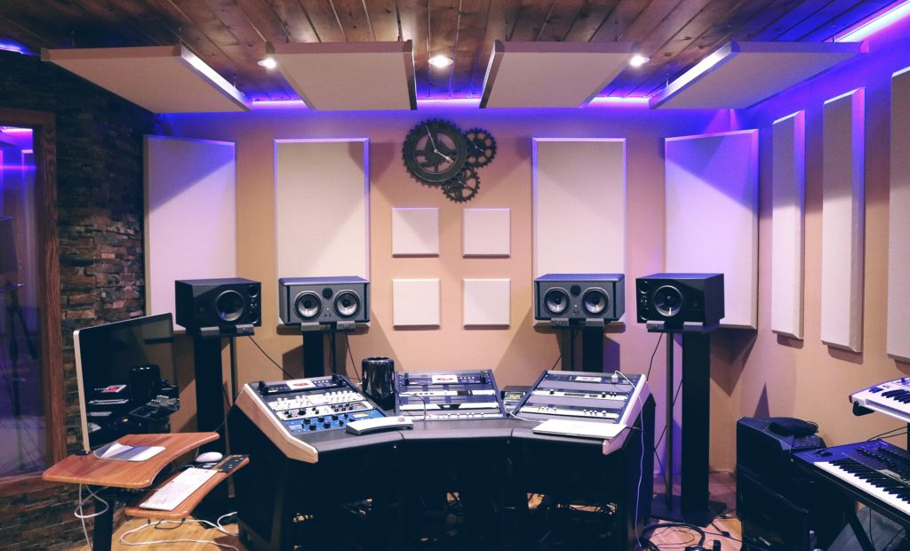

<!-- TODO: Add More Affiliate Links (Or Link To Store) -->

You will continually upgrade your studio from the second you download your first DAW to long after, when modular synths line the walls of your home like a mad science lab. Knowing what equipment to buy and when to buy it is vital to improving your sound without wasting time and money. We are going to take a look at how a home studio build evolves from humble beginnings to touring some of the best home studio's ever built and what gear to get each step of the way. Tier 3 includes a large checklist of different tools and quality gear essential to a studio. Here is the overview.

<ul>
 	<li >Tier 1: A computer, DAW and headphones</li>
 	<li >Tier 2: Interface, Mic, Midi controller and Monitors</li>
 	<li >Tier 3: Capability to record, mix, and master hit records</li>
 	<li >Tier 4: Pro</li>
 	<li >Tier 5: Top Pro</li>
 	<li >Tier 6: I'm rich bitch!</li>
 	<li >Tier 7: Hans Zimmer</li>
</ul>
<h2 >Tier 1 : A Computer, DAW, and Headphones</h2>

So it begins. Starting with just a computer, you download a DAW like <a href="https://shop.presonus.com/products/software/studio-one-prods/Studio-One-3-Digital-Downloads" target="_blank" rel="noopener noreferrer">Studio One Prime</a>, <a href="http://www.avid.com/pro-tools-first" target="_blank" rel="noopener noreferrer">Pro Tools First</a> or <a href="https://www.apple.com/mac/garageband/" target="_blank" rel="noopener noreferrer">Garage Band</a> for freeeeeeeee and start fiddling around. After making a couple little tracks and feeling the music drugs taking hold of your system the limitations of the free DAWs might not be enough anymore. Good old midisequencing.com will tell you <a href="/article/which-daw-should-i-use">what DAW is best for your situation.</a>

After installing a fresh, shiny new DAW you might think, "Wow, look at all these built in soft synths, samples and different plugins." The more music you make the more familiar you'll get with the tools in your DAW and what you are capable of making. Eventually there will be a day you say, "hey, this is pretty good, I'm the bomb." and post some stuff on SoundCloud. Nobody else likes it. It's devastating, "I suck, I am shit and should just quit."

<strong>Don't get down on yourself. This cycle of "I'm dope...no wait, I suck" will continue a long time if not forever, it's part of being creative.</strong> You do it because you love it and <em>eventually</em> a hot neighbor girl says, "I heard you are making some tracks, I've been writing some songs and sing a bit, maybe you could record me." you say, "YES!" Always say yes! Problem is, you've been recording samples on your phone and don't have a real mic. It's time to upgrade the home studio.

<h2 >Tier 2: Interface, Mic, Midi Controller and Monitors</h2>

Luckily these days you can get a pretty decent mic and interface for not a ton of money. If you'll mainly be recording vocals you probably want a Large Diaphram Condensor mic (LDC for short). If you only have a hundred bucks to spend on a LDC I would recommend the <a href="https://amzn.to/2Rzrz3d" target="_blank" rel="noopener">Audio Technica 2020</a>. If you have a bit more money a lot of people recommend the <a href="http://amzn.to/2Nvd3pL" target="_blank" rel="nofollow noopener">Rhode NT1</a>, which will run you about 270. If you have even more money, a dynamic mic like the <a href="https://amzn.to/2IL2ZbN" target="_blank" rel="noopener">Shure SM7b</a> might be your best choice because you'll definitely use it forever and it won't pick up as much room noise as a LDC.

Like all things in life, <strong>buy the best quality you can afford</strong> <strong>because it saves money in the long run.</strong> You should consider buying a higher quality mic or a high quality used mic if your budget allows. For cheaper gear it's best to buy new unless you know for a fact that it was well taken care of.

Your hot neighbor texts you and says her boyfriend wants to come play electric guitar on the song too. Lame. But you say it's cool, and text back, "Will he play at the same time as ur singing?" She says "Yeah maybe."

You have to get an audio interface with 2 inputs. The guitar goes directly into the interface DI(hi-Z input), and the mic your neighbor sings into goes on the other input. A lot of people starting out these days are using the Focusrite Scarlett 2i2 which will do the job. I can't personally attest to it's sound because I haven't used one but it's very popular, cheap, and gets great reviews.

What about monitors? My opinion is you shouldn't invest in monitors until you can afford ones that you'll use for awhile. A lot of hip hop and EDM producer's get KRK rockets, which is the bottom of what I would feel ok recommending. A pair would run you around $300. If you are serious about mixing and not doing just EDM or Hip Hop, then you probably want to save for something different. I use Adam A7x, which are great for film scoring and I would keep them even if I won the 200 million dollar powerball, which is a great litmus test for gear. "If I had unlimited money, would I still use this?"

If you can't afford decent monitors, fortunately/unfortunately most people listen to music on laptop speakers, earbuds and their phones, so in turn, mixing engineers at every level should partially mix and/or check their mixes on all these devices. <strong>You aren't going to hurt yourself by learning how to make a killer mix on laptop speakers and headphones, you will become a better mixer because of it. </strong>

<h3 >Your First Home Recording Session</h3>

You got the mic and interface - Check. You test the setup to make sure everything is running alright - Check. You realize the interface only has one headphone output - Crap. How are all three of you going to listen at the same time? After doing some googling you find a 5 dollar headphone splitter will do the trick, it's a smart and cheap solution, good job. So much of recording is preparing and anticipating everything that can go wrong.

The neighbor girl shows up with her guitar playing boyfriend to do some recording. She sings into the mic and you set the gain levels on your interface to get a decent signal going in, same with her boyfriend's guitar. Ready?

Half way through recording the first take the singer starts getting really into it, she's singing way louder than she was when you first set the levels. Horrible distortion. They stop playing and look at you. WTF man? What's wrong with the sound? Killing the vibe is the opposite of an engineers job, you screwed up.

Every time you go into the studio and make a mistake you learn a lesson. As time goes on you'll mess up less, it's a part of the process. Turn down the levels, try something new.

Always be experimenting so you can figure out what you are capable of with the gear you have. Where does your mic sound best in relation to a singer and why? What are all of the stock plugins inside your DAW and what are they used for? What <a href="http://www.tokyodawn.net/tokyo-dawn-labs/" target="_blank" rel="noopener noreferrer">free plugins</a>, <a href="https://asb2m10.github.io/dexed/" target="_blank" rel="noopener noreferrer">synths</a> and <a href="https://output.com/products/signal-free" target="_blank" rel="noopener noreferrer">samples</a> are worth trying? There is a lot you can and should do before spending money.

A more upgraded "tier 2" studio owner will definitely <em>buy</em> plugins and maybe some more hardware when they start to figure out what musical direction they're going. Eventually you'll know why you want the more premium stuff. This is when it's time to take things to the next level.

<h2 >Tier 3: Capable of making hit records</h2>

Here is where you go from spending a few hundred to a few thousand. Somebody who really knows what they are doing can 100% record, mix, and master hit songs with a "prosumer" setup. Just ask Skrillex.

At this point you've spent a lot of time making music and probably have an idea of what you are looking for. A better interface, better mics, and more plugins.

A mixer/producer who doesn't need a lot of inputs would get something like an Apollo Twin Duo so they can make use of Universal Audio's plugins. A recording engineer who is interested in building a mobile studio might get Antelope's Zen Studio with 12 mic pres and a bunch of mics for tracking a full band simultaneously. Those working in film scoring invest in a beast of a computer and some nice sample libraries.

Whatever you buy to upgrade your studio let me warn you, <strong>it will probably sound awesome</strong>. The improvement of sound and new creative possibilities will be so astounding you'll get a nice little buzz with each new piece of gear you get. <strong>The high</strong> <strong>that comes with getting a new piece of gear can give you GAS</strong>. Not gas out your ass, but <strong>G</strong>ear <strong>A</strong>cquisition <strong>S</strong>yndrome. Tragically common in the audio production world, people infected with GAS go spending their money on sweet new gear all the time that they never fully utilize. I'm not saying "don't get all the cool stuff you can", <strong>just</strong> <strong>be wise with your choices. </strong>

<h3 >Quality Gear</h3>

I want to take a moment to list some of the gear that have become standard in the audio/music world. Nobody paid me to put them on this list, it's just what I use and see my friends and peers using.

If you want to buy one bundle to cover all of your basis for mixing, producing and composing, <a href="https://www.native-instruments.com/en/products/komplete/bundles/komplete-11-ultimate/" target="_blank" rel="noopener noreferrer">Komplete Ultimate</a> by Native Instrumants will do the trick. It includes synths that have become classics like FM8, Reaktor and Massive. There are tons of different samples of varying quality and really well made classic compressors and eq emulations by Softube including the 1176, LA2A and DBX160. Everybody should have some version of these compressors in their arsenal.

Speaking of classic emulations, <a href="http://www.uaudio.com/uad-plugins.html" target="_blank" rel="noopener noreferrer">Universal Audio</a> is king when is comes to making digital seem analog. Their versions of the 1176 and LA2A are arguably the golden standard. UA makes some killer preamp emulations of API and Neve stuff as well. They have awesome tape machine emulations and a whole assortment of straight digital plugins like the Massenburg EQ that do what other things can't. You need hardware to run UA plugins, like one of their interfaces or a "satellite", but if your main deal is mixing, get into UA stuff ASAP.

The crème de la crème of reverb plugins for me is <a href="https://www.sweetwater.com/store/detail/Altiverb7" target="_blank" rel="noopener noreferrer">Altiverb</a>, it is expensive AF but it's the last reverb you ever need. What are some of the most classic reverbs of all time? The EMT 140 plate. Altiverb has 2 of them sampled. AMS RMX-16 (Phil Collins Drums In the Air Tonight) - Got it. Lexicon L480 and L224 - Got It. An Egyptian pyramid - Got it. Ok that's not a famous reverb but it's a cool 13.2 seconds of tomb sound. The concert halls and studios are great choices for convolution. Technically the whole thing is a convolution reverb, so it's not the lightest load on the CPU but I've run tons of instances with no problems. Find some good reverbs to use. You don't necessarily even need to buy anything, there are some dope impulse responses lying around the internet, you might have to sift through a lot of crap though.

<a href="https://www.izotope.com/en/products/master-and-deliver/ozone.html" target="_blank" rel="noopener noreferrer">Ozone by iZotope</a> is an all in one mastering tool that makes your stuff sound boss. It has EQs, saturation, multi-band compression, a brick-wall limiter and more built in. iZotope makes a <a href="/article/vocal-synth-1">bunch of great stuff</a>, check them out.

You know who else makes great mixing/mastering/effect plugins? <a href="https://www.fabfilter.com/products/" target="_blank" rel="noopener noreferrer">Fab-Filter</a>. Fab-Filter's Pro Q2, a straight digital EQ, is super low CPU intensive and has quickly become a standard. Their brick-wall limiter, the Pro L, is dope, their D'esser is dope, their compressor is dope. They make dope stuff. Their programmers and engineers really know what they're doing.

Waves has been around a long time, their API 2500 Bus compressor is so choice. They also have a bunch of other emulations of classic gear as well as originals designed with the help of famous engineers like Tony Masserati and Chris Lord-Alge.

Slate Digital is a reputable company and you can get all their plugins for 15 bucks a month, which will really cover your basis.

<a href="http://www.soundtoys.com/" target="_blank" rel="noopener noreferrer">Soundstoys</a> makes a bunch of effects for messing with your audio. Their Decapitator distortion has been used for years to add warmth, it's all over Nine Inch Nails stuff. You can take a sound and run in through some of Soundtoys stuff like Echo boy and a Chrystalizer and get something cool, weird, and completely new really fast.

What about samples? Check out companies like Spitfire, Vienna, East West, Native Instruments, Cinesamples, and Audiobro for orchestral stuff. There are tons of virtual synths/instruments out there. Output, Sylenth by Lennar Digital, U-He stuff, Omnisphere by Spectrasonics are all awesome off the top of my head.

For monitors, as I mentioned, I use Adams but there are a whole bunch of great choices out there, most people want to get <strong>active near field monitors</strong>. Dynaudio makes great monitors that a lot of my buddies use. Do some research, check for used options, listen in the store or at your buddy's studio, something will call to you.

As for interfaces, the vast majority of people I'm around use either something from Apogee or Universal Audio. RME, Lynx, Antelope, and Grace are all reputable companies that make great interfaces as well. The relatively new Avid HD i/o's are great but in my opinion Avid stuff is really only for people looking to get a Pro Tools HD system and that's well above the tier 3 pay grade.

Mics, instruments, and outboard gear you may or may not buy really depend on your situation. Do you're research and try not to catch GAS.

<h3 >Acoustics</h3>

Even if you have $10,000 dollar monitors, they won't do you much good if you don't put them in the right spot or you have a crappy sounding room. When we talk about good room sound we are not talking about sound proofing.

Sound proofing is very difficult and doing it is not cheap. If you want to completely sound proof a room you are going to build a whole <strong>room within a room.
</strong>

One cheap/effective trick you can do that might help with "sound proofing" is lining your doors and windows with rubber or vinyl door seals and weather stripping. A lot of sound escapes through the cracks or under the door so making sure yours are sealed air tight could add some extra "sound proofing".

As for monitor placement. You want to have your monitors and your head be three points of an equal lateral triangle. The distance between your head and both monitors should be the same as the distance between the two monitors. For the height, you want the tweeter (the little speaker) to be around ear level.

The way sound bounces around your room can cause crappy unwanted noises or some specific frequencies to be boosted over others. When this happens you make adjustments to your mixes to make things sound good in your room but will sound bad/strange in other places.

To correct for these unfortunate side effects you will want to place bass traps, acoustic absorption panels and diffusers in your studio. <strong>It is much cheaper to make these things yourself, </strong>make sure you do a great job if you do it, make them look nice<strong>.</strong> Bass traps and panels are made of materials like fiberglass, rockwool or denim insulation while diffusers are normally made out of wood.

One cheap and classy way you can help diffuse the sound in your studio is by putting up bookshelves. If the books are all different sizes it will help break up the sound in the room.

Where to place the panels in your room really depends on your room. You most likely will want to place some absorption panels at the first point of reflection off of your walls. To find these spots, sit in your mixing chair where you normally would sit and have a friend hold a small mirror against the wall. Have your friend move the mirror starting by the speakers at your eye level and moving across the wall in the direction you're sitting. When you see your monitors in the little miror, you have found the spot. Put a panel there. Do it on the other side too.

In addition to the treatment listed above there is also software room calibration technology. This works by setting up a microphone and having the software play sound out of your monitors to figure out what the problems are in your room, then the software compensates for these problems. <a href="http://www.sonarworks.com/" target="_blank" rel="noopener noreferrer">Sonarworks</a> sells a software/mic for $300, while Trinnov makes a hardware version starting in the $3000 range.

If your floor is a reflectiv surface you will want to put a carpet down. It will be difficult to get a really quality sounding room without dropping a fair amount of money. Make sure you are listening to your music on other systems, headphones, in the car and try to get it to sound good on everything.

<h3 >Studio Checklist</h3>

To recap here's an idea of what your studio might be looking like and what you should have an idea about how to use.

<ul>
 	<li>Good quality interface with the inputs/outputs you need</li>
 	<li>Studio Monitors that you could keep around forever</li>
 	<li>Quality Reverbs</li>
 	<li>Variety of compressors for different situations, preferably including emulations of some tried and true classics.</li>
 	<li>A solid brickwall limiter</li>
 	<li>EQs for different situation, like a surgical digital EQ for cutting out bad stuff and something like a classic console EQ to enhance the sound.</li>
 	<li>A Multiband compressor.</li>
 	<li>Utility plugins like noise gates, D'essers, gain knobs, polarity switches, test oscillators ect.</li>
 	<li>Other effects, like delays, distortions, flangers, filters, chorus, phasers, amp simulators, pitch correction ect. ect.</li>
 	<li>Your favorite DAW of course, and possibly a couple others you use for different purposes.</li>
 	<li>Midi Controller, could be pads, keyboard, just faders, whatever you dig</li>
 	<li>Instruments, samples and soft-synths</li>
 	<li>Decent quality mic/s depending on your situation</li>
 	<li>Possibly outboard mic pres, channel strips, and other effects</li>
 	<li>Maybe A Power Conditioner and maybe a reflection filter, unrelated stuff but both solid maybes</li>
 	<li>Slew of cables and adapters</li>
 	<li>Acoustic Treatment</li>
 	<li>Computer/s that works well</li>
</ul>

While having these tools will make your studio work, a Pro takes things to the next level where more of the sonic magic lives.

<h2 >Tier 4: Pro Level</h2>

The main staple of a professional quality home studio is a properly treated room that looks like a studio. The bass traps are trapping the bass, the panels are placed right and the diffusers diffuse out bad reflections all while looking cool and matching. The space is a dedicated studio in a spare room, garage, or pool house that can host clients for recording and listening, a big upgrade from the bedroom. At this point you might have built a sound proof vocal booth to record in. It's a very functional studio.

In addition to having a good room a pro studio just has more. More mics, more plugins, more instruments, maybe a second or third set of monitors, and more outboard gear. For me one of the biggest jumps I've ever heard in recording quality is with the use of outboard mic pres. Yes, your interface's built in pres are probably fine and software plugins can do amazing things, but there is a special magic that comes from running a mic through an analog pre, it's part of what makes different consoles famous for their sound.

To get an idea of how outboard gear can change the quality of sound, check out this video directly comparing the original and the emulation.

<iframe src="https://www.youtube.com/embed/_IuzjrD2gRw?start=738" width="560" height="315" frameborder="0" allowfullscreen="allowfullscreen"></iframe>

Luckily in this day and age you don't have to spend tens of thousands on a full recording console, you can buy rack mounted channel strips one at a time or buy 500 series gear. If you aren't familiar with 500 series stuff, it consists of a chassis where you can add in different analog gear like mic pres, eqs, compressors and synthesizers. The units are smaller than your standard rack gear but the sound is so amazing that even the most frugal of engineers can get GAS from 500 series stuff. They buy one mic pre and immediately want to fill up the chassis, before you know it, there goes 5 grand.

I love 500 series stuff. Something spectacular happens when you record a bass, guitar, snare or kick through an API 512c. To improve the quality of sound, mixing engineers will send audio that has already been recorded to outboard gear including 500 stuff and record it back in because it gives you something software plugins can't. If you haven't noticed, stuff is starting to get expensive.

<h2 >Tier 5: Top Pro Level</h2>

The top pro studio has a lot more money to build with and with money comes more options. There is still a limit to what a top pro can spend money wise, but it is a pretty freaking high limit. What are we looking at here?

Let's start with monitoring. If you're running a studio with a really professional mixing setup you'll have your main monitors or some midfields, and probably two different sets of near field monitors. Back when you bought your first set of nice monitors, if you did a good job, you can use them as one of your near field sets. Which might have cost you anywhere from $500 for something used to a few thousand. Really nice near fields can get up past $10,000 for a pair. A lot of studios have Barefoot Sound's Micromain27s, that go for $10,500.

The second set of near fields might be some Yamaha NS-10s if you want to track them down or a set of the Auratone 5C Super Sound Cubes. Those won't really set you back to much, a few hundred to a grand or so. It's the mains that get you.

Your main monitors usually will run anywhere from $10,000 to $35,000. They can be more, that's just what is normal for a pair. Companies like Tannoy, Augspurger, Adam, Dynaudio and ATC make many of the most used models. Depending on what you know, it might be best to hire an expert to start setting things up for you.

<h3 >Pro Tools HDX</h3>

If you wanted to get a Pro Tools HDX system, you need the HDX PCIe card, that's $3000, it's what you plug your interface into and has some DSP processing. Goes like this, Interface (connects via Mini Digilink Cable)-&gt;HDX PCIe Card ( Connects to computer Via PCIe slot or PCIe to Thunderbolt box) -&gt; Computer.

The actual AD/DA converter, for 16 channels of analog audio, will be $4500 for an Avid HD IO. Then you need a license for the software, that's going to cost you either $1000 a year or $2500 for a perpetual license. So you are looking at $8,500 for 16 channels with no preamps if you go straight Avid.

Each HDX PCie card is capable of running 64 channels. So if you have a big set up and need to route a lot of audio you'll need another card and another $3000. You don't necessarily need the Avid HD io interface to run an HDX system, both Antelope and Apogee make compatible interfaces. In fact, Antelope's Goliath HD interface has 64 channels with 12 preamps and also works on USB and Thunderbolt in case you ever want to ditch Pro Tools or use just use another DAW. Costs you $7000, which is a friggin bargin compared to what you'd need to get for 64 channels with Avid's stuff.

Why else might you want to do that? I can speak to the future but here's what happen a few years ago when Avid went from Pro Tools HD to HDX. They stopped supporting their old blue interfaces, they still worked, but are "not supported". When there are a million technical things to keep track of this can be unsettling. So if you had a big system, you had to basically replace everything. This probably won't happen again because they've switched to a "subscription" system and are adapting to the new business realities of the world of audio. Also their HD converters are really great while the old 192 didn't have the best reputation, so it is an great upgrade, it's just really really expensive all over again.

<h3 >Note about buying</h3>

When you are spending tons of money on gear there is wiggle room. If you're buying the high end stuff then you'll have your own personal sales rep that you can negotiate with. "Come on Bill, you're really bustin' my balls here, I can do it for 200 less." The more stuff you buy at once, the more discount you can get. So it's better to save up a bunch of money and buy your monitors, HDX system, some mics and other stuff all at once if you can and you could save thousands.

When you <strong>have</strong> <strong>the money </strong>or a proper <strong>low interest</strong> loan secured, buy your stuff with a credit card and pay it off immediately. Search around for credit cards that offer great sign up bonuses. I've gotten multiple round trip tickets to Europe for free doing this. The purchase is a tax write off, because it's your business, so if you always buy your gear with your "business" credit cards it's easy to keep track of what you've spent and you get sweet perks. Always keep the receipts ;)

<h3 >Mic Locker</h3>

If you are recording a fair amount then your mic locker will be growing through the years. Here is an example of what you might find in any top pro's mic locker.

<ul>
 	<li>A few LDCs for different characteristics on different sounds, things like an AKG C414, Neumann U87, or the Manley Reference mic.</li>
 	<li>At least 1 matched stereo pair of Small Diaphragm Condensors, like the Neumann KM 184, DPA 4006a or Telefunken ELA M260.</li>
 	<li>Maybe some Ribbon Mics for a different character sound, like the Royer R-121(great on guitars) or the Sontronics Apollo (amazing on piano), Cole 4038 (sweet for drum Overheads/brass)</li>
 	<li>A whole heap of dynamics. A bunch of Shure SM57s, a dynamic for kick drum like the AKG D112 MKII, maybe a Shure SM7b.</li>
</ul>

That should cover the basis.

<h3 >Outboard Gear and Other</h3>

The amount of compressors, preamps, eqs, synths, instruments and everything else is up to you. You'll figure out what toys you like with along the way and buying this stuff might never end.

<iframe src="https://www.youtube.com/embed/rSWBuZws30g?start=109" width="560" height="315" frameborder="0" allowfullscreen="allowfullscreen"></iframe>

<h2 >Tier 6: I’m rich bitch!</h2>

Some people get stupid rich making music and can build whatever they imagine. A lot of the times these people are film scorers because they get big commissions and then their PRO checks can get well into 6 figures or more per quarter. Let's look at some of them, starting with my favorite setup I've ever seen, composer John Powell. He shows his wife's art studio at the start so the video jumps straight to the kitchen.

<iframe src="https://www.youtube.com/embed/rpempyrPUtI?start=113" width="560" height="315" frameborder="0" allowfullscreen="allowfullscreen"></iframe>

John Powell is a composer composer. By that I mean, I get the sense from him and his music that he is not someone who is obsessed with the technical things, vintage synths ect. but spends more of his time worried about melody's, chord voicings and is focused more on purely the musical realm. He probably could compose with a piano, pencil and paper if needed.

Tom Holkenborg, AKA Junkie XL, comes from the world of electronic music. This guy knows everything about vintage synths and gear. A lot of times composers at this level will hire a technical assistant or an expert to setup a studio and recording/composing rig for them, I get the feeling Junkie XL personally built his.

<iframe src="https://www.youtube.com/embed/aGgVd0ckkUw" width="560" height="315" frameborder="0" allowfullscreen="allowfullscreen"></iframe>

Lastly, check out Deadmau5 studio. He knows his stuff and has things exactly how he wants it. What I like about this tour is he specifically talks about how you don't need all this stuff, it's just awesome to have.

<iframe src="https://www.youtube.com/embed/9MnQ0PPLcC4" width="560" height="315" frameborder="0" allowfullscreen="allowfullscreen"></iframe>

<h2 >Tier 7: Hans Zimmer</h2>

Zimmer means room in German and Hans has a dope Zimmer, he has a lot of Zimmers, more like a village.

<iframe src="https://www.youtube.com/embed/IuvRvTlgRcc" width="560" height="315" frameborder="0" allowfullscreen="allowfullscreen"></iframe>

I added Hans as a separate section because I think it is as far as someone can really take a personal studio not backed by a major company. Also amazing things happen at Remote Control (that's the name of Hans' studio complex).

Remember John Powell's studio? He got started working with Hans. Junkie XL works with Hans, if you look up Henry Gregson Williams, another great film scorer with a dope studio, he started with Hans. Remote Control is an incubation center for where the seeds of the great studios of tomorrow are germinated.

<h2 >In Conclusion</h2>

That about covers it, thanks for reading! This is a vast topic with a lot of ins and out and details you might want to personally change. The more knowledge and experience you have making music the more badass of a studio you will be able to build. Dream big, work hard, keep learning, and make something dope.
