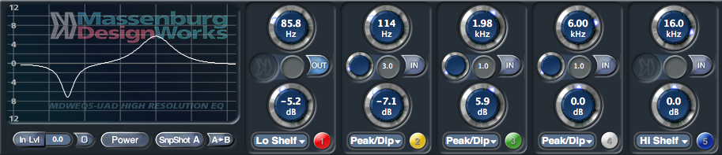
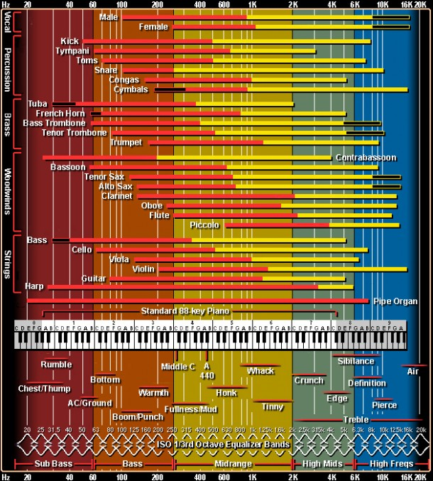

Behind the volume faders,<strong> EQ is THE most important tool in mixing.</strong> In this article we will talk about the different types of EQs, how to use them, and some of the best EQs ever invented (including a freebie you should download today).

<!-- A quick word of advice. Once you understand the power of EQ you might be tempted to "fix" things in the mix rather than doing it right from the start. As I mention in the <a href="article/music-vs-sound/">Music VS Sound</a> article, this is recipe for pain. When you are setting up your mics, designing a synth patch or choosing samples, try to get it sounding as good as possible without telling yourself you can fix it later. Sometimes this means abandoning ideas entirely. Just know the sooner you find great sound in the process, the better off you'll be. -->

<h2 >Vital EQ Info</h2>

<h3 >EQ Parameters</h3>

<ul>
 	<li><strong>Frequency</strong>: High, low, mid? The literal definition is measured in Herz and it is how frequent the peaks and valley of the sound wave is.</li>
 
 	<li><strong>Boost/Gain:</strong> Make louder</li>
 	<li><strong>Cut/Attenuation:</strong> Make softer.</li>
	 	
 	<li><strong>Band/Bandwidth/Q/Bell/Trough/Notch:</strong> This is the range of frequencies you are EQing.
	 <li><strong>Shelf:</strong> When all the frequencies above (if a high shelf) or below (low shelf) will be boosted or cut.</li>
 	<li><strong>Filter:</strong> When all of the frequencies in a range are taken out</li>
</ul>

<h2 >Types of EQ</h2>

Despite some EQ's abililty to give really precise control, sometimes you can get better results using simpler tools like Shelving EQs and Graphic EQs.
<!-- In this day and age you can sculpt out frequencies with lazer precision. Despite having that ability, sometimes simpler tools with only a few knobs will ultimately sound better. -->

<h3 >Shelving EQ</h3>

Shelving refers to turning up or down every frequency above or below a certain point. The picture above shows what shelving looks like on the frequency spectrum.

Simple shelving is a very common technique to create space in your mixes or help certain instruments stand out by making them brighter or darker.

Some EQs, like the Pultec EQP-1A pictured below, LIMIT your choices of frequencies for shelving. **Limited choices can be a great thing**. In the bottom left corner the knob that is labled "LOW FREQUENCY" gives you 4 choices, 20hz, 30hz, 60hz, 100hz, to boost(turn up) or attenuate(turn down). These old EQs are famous and still used today because they consistently get great results.

**TIP for Logic X Users**: Logic has these simpler EQs built in. In your plugins go to EQs -> Vintage EQs and give them a try.

<h3 >Graphic EQ</h3>

Graphic EQs are simple and limited as well but can turn out some really nice results. You are not able to select any frequency with a graphic EQ, the choices are made by the manufacturer. On the API 560 pictured above there are 10 frequency "<strong>bands</strong>" to choose from. 

In practical mixing usage, graphic EQs are best used as a sweetener.

<h3 >Parametric EQ</h3>

The vast majority of time you will use some version of parametric EQ when mixing. 
George Massenburg coined the term "parametric eq" in 1972 and later designed the awesome plugin pictured above.

What makes a parametric EQ so special is the ability to select essentially any frequency or range of frequencies with surgical precision and boost or cut them.

Parametric EQs are great for finding trouble frequencies. As we'll demonstrate later. 

<!-- Human hearing ranges from 20 hz on the low end all the way up to 20,000 hz. If you check back to the API 560, there are 10 frequencies options to choose from, so if you wanted to cut only around 400 herz for example, you couldn't do it. Hallelujah, we have parametric EQ! -->

<h3 >Band Compression</h3>
     

Technically band compression is a form of compression but functionally it is a form of EQ. If you are just learning the fundamentals of mixing, band compression isn't something you need to try and wrap your head around right now. The basic idea is to turn down a certain frequency range, under certain conditions, in a certain way. One of the most common uses for this is when D'essing.

<iframe src="https://www.youtube.com/embed/k-MBRGvmIWU?start=785" width="560" height="315" frameborder="0" allowfullscreen="allowfullscreen"></iframe>

<h2 >How To Use EQ</h2>

<h3 >High-Pass Filter</h3>

<strong>A High-Pass filter is placed on the low end of the frequency spectrum</strong> and allows high frequencies to pass through while eliminating the frequencies below entirely. The higher up the frequency spectrum you move a high-pass filter, the thinner the sound will become.

 High-pass filters are vital for removing unwanted low frequencies that will muddy up a mix. See the demo below. 
<iframe src="https://www.youtube.com/embed/k-MBRGvmIWU?start=161" width="560" height="315" frameborder="0" allowfullscreen="allowfullscreen"></iframe>
<!-- 
Not only is a high-pass filter great to put on many instruments, you most likely will want to put one on your entire mix as well, going up to around 30-40 hz. The reason you do this is because, especially with today's soft synths, there might be low frequencies you can't hear that will muddy things up and mess with any compressors or effects you put on your master bus. -->

 <!-- When you do this consider using a <strong>LINEAR PHASE EQ. </strong>A linear phase EQ removes the phasing found in normal eqs but can be more processing intensive. If you're not sure if you have one, the <a href="http://www.tokyodawn.net/tdr-vos-slickeq/" target="_blank" rel="noopener">TDR VOS SlickEQ</a> by Tokyo Dawn Labs is a free linear EQ and it is amazing!!!!!! Seriously, download it. -->

### Low-Pass Filter

When a bomb explodes next to someone in a movie and the character's hearing is muffled, that is a low pass filter.

 It might be a little confusing that a low-pass filter deals with high frequencies while a high-pass filter deals with low frequencies. 
 
 The important word to remember is <strong>PASS. The name of the filter indicates which frequencies you will be able to hear</strong>.
 
 To deal with this some people started calling a "High-Pass" a "Low Cut" and vice versa. Which might makes things easier to understand.
 
  If you get confused try to come up with your own naming trick.

<iframe src="https://www.youtube.com/embed/E5P5c1InZNk?start=24" width="560" height="315" frameborder="0" allowfullscreen="allowfullscreen"></iframe>

<h3 >Subtractive EQ</h3>

fSubtractive EQ is the process of finding crappy frequencies and cutting them out. This works by boosting a narrow band to find the bad stuff then simply turning it down. As demonstrated below.

<iframe src="https://www.youtube.com/embed/k-MBRGvmIWU?start=414" width="560" height="315" frameborder="0" allowfullscreen="allowfullscreen"></iframe>

Your ability to determine when there are crappy frequencies that need zapping comes with experience.

To help guide you in the right direction there are a ton of EQ charts that tell you what frequencies are associated with common adjectives we use to describe sound. 

The great chart below is made by <a href="http://www.independentrecording.net/irn/resources/freqchart/main_display.htm" target="_blank" rel="noopener">IndependentRecording.net</a> and tells you where different instruments are heard, names of the frequency ranges (ie high mids, sub bass ect.), and the adjectives that describe the frequencies.

  

<h3 >Additive EQ</h3>

Additive EQ boosts frequencies. Boosting frequencies can sweeten the sound of an element, make it cut through the mix, or simply change the sound. 

Normally when you are doing additive EQ you'll get better results by boosting with a wider band-width as oppose to the narrow notch that you might use when doing subtractive EQ. Looks like this.

<iframe src="https://www.youtube.com/embed/k-MBRGvmIWU?start=589" width="560" height="315" frameborder="0" allowfullscreen="allowfullscreen"></iframe>

Personally, when I'm doing additive EQ I prefer to use EQs modeled from famous channel strips rather than an EQ with a visualizer. The Helios sounds great for boosting high frequencies for example.

There are two great benefits to using channel strip EQs.

<ol>
 	<li>You have to use your ears. There are only knobs and no visualizer to influence you.</li>
 	<li>Channel strip EQs have distinct sounds that come from their designers well informed choices. Moving these knobs were simply designed to sound good when used.</li>
</ol>

When you are EQing do not rely on your eyes. <strong>Use visual analyzers infrequently</strong>, only when you really need to check something!

<h3 >Soloing EQ VS In the Mix</h3>

In the videos above we only listened to solo'd instruments while EQing. Generally, even though it is more difficult to hear, you will want to EQ your elements while still hearing the entire mix. This isn't a rule, there are no rules, but it is a good method of practice because people don't hear the instruments solo'd, they'll hear the entire mix.

A solo'd instrument might sound completely weird alone while it sounds really good when surrounded by the mix. Different instruments in the mix might fill in strange frequency gaps from something that sounds bad solo'd but good in the mix. The times you would want to solo an instrument to EQ is when you suspect there is a crappy frequency and you want to do some subtractive EQing.

<h3 >Mastering</h3>

Besides making things louder, <strong>most of mastering is EQing</strong>. 

When you are mastering you will usually only want to cut or boost 1-2 db, maybe 3 of a given frequency band. Adding EQ on the master bus is like adding an EQ to every single instrument in your mix. If you find yourself having to do extreme cuts or boosst in mastering, you probably want to go back and fix your mix.

Lastly, you might find your mix will get better by adding high pass filter around 10-20hz to clean out any extremely low frequencies not actually adding anything to your mix.

<h3 >Loose Ends</h3>

EQing is very situation specific, so presets are useless. I would go so far to say presets will hinder your development as a mixer and suggest you don't bother with them. It will take time to develop a sense of what you can a should do with an EQ, keep at it and you will learn.

You can very easily lose your mind while EQing and make something that sound worse without realizing it. A lot of times your first instincts will be correct. The first bit of EQing you apply will sound as good as you can make the sound but then you start to think, "wellllllll, would if I tried boosting here more. Wellllll maybe I need a sharper cut here....Welllllll..." And you end up with some alien sound that is nowhere near as good as what you did in the first 2 minutes.

Check out what Bruce Swedien says about mixing Billie Jean.

<iframe src="https://www.youtube.com/embed/8OjqM6uHsY4" width="560" height="315" frameborder="0" allowfullscreen="allowfullscreen"></iframe>

One last thing to note, your system, whether it be your room with monitors, or headphones or whatever, will probably boost and cut certain frequencies thus tricking you into thinking you are sculpting a sound one way but it will sound completely different on other systems. **Be sure to check your mixes on multiple sources** to get an idea of how your system may be deceiving you so you can compensate for it.

Thanks for reading, you might want to check out <a href="/article/reverb-essentials">Everything You Need To Know About Reverb</a> or <a href="/article/how-to-build-a-studio">How to Build A Home Studio From Nothing to Everything</a>.

Here is the full tutorial if you would like to watch it :)

<iframe src="https://www.youtube.com/embed/k-MBRGvmIWU" width="560" height="315" frameborder="0" allowfullscreen="allowfullscreen"></iframe>
