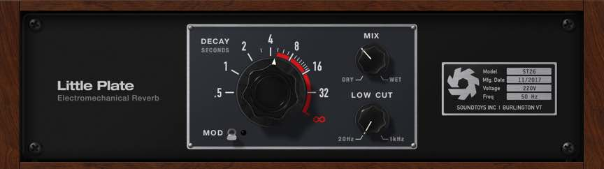
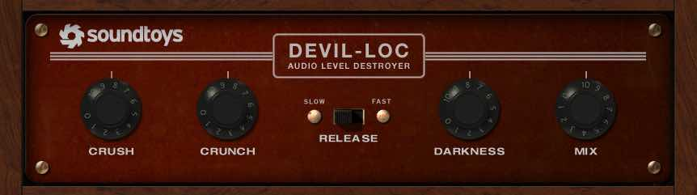
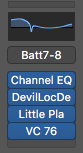

<iframe width="560" height="315" src="https://www.youtube-nocookie.com/embed/gN_om4q67V8" frameborder="0" allow="accelerometer; autoplay; encrypted-media; gyroscope; picture-in-picture" allowfullscreen></iframe>

Turns out that giant drum sound you hear at the start of movie trailers is pretty simple to make. It takes 3 things.

- A Drum Sample
- A Quality Reverb
- Compression

The reverb I used to make this sound is the <a href="https://www.soundtoys.com/product/little-plate/" target="blank">Little Plate</a> by Sound Toys.

Simple to use and extremely effective, I find myself reaching for this reverb for a lot of different sounds from Cinmatic drums to lead vocals.

## The Little Plate

After the Little Plate you will want to add compression. **A lot of compression.**

The compressors job is to brind the reverb tail way way way up so that it is basically equal in volume to the drum hit. You can see at the start of the video how hard the drums are hitting the compressor.

<iframe width="560" height="315" src="https://www.youtube-nocookie.com/embed/gN_om4q67V8" frameborder="0" allow="accelerometer; autoplay; encrypted-media; gyroscope; picture-in-picture" allowfullscreen></iframe>

To help low rumble I added some EQ before the reverb. This adds a bunch of low end to the sample before it goes throught the reverb, thus the low end is being fed into the reverb rather than EQing at the end of the chain where we would trying to bring up what's in the reverb already.

Feel free to experiment and change up where the EQ is though. Depends on your reverb and drum sample.

Later on I added another Effect by Sound Toys, <a href="https://www.soundtoys.com/product/devil-loc/">the Devil-Loc</a>.
This gives the ability to change the sample with some distortions/compression and overall vibe.

## The Devil-Loc

Overall the Effects chain on top of the drum sample went like this.

<ol>
<li>EQ</li>
<li>Devil-Loc</li>
<li>Little Plate</li>
<li>VC 76 Compressor</li>
</ol>

Easy enough.

Thanks for reading.
