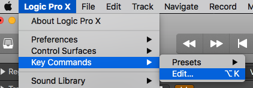

Above is a video detailing the way I use my midi controller to control Logic. Below I will explain how I set it up.

Note: There are ways to automap but this is for a custom setup. The initial setup is more involved but in the end the setup fits my workflow like a glove.

## Setting Up the Midi Controller

Before connecting my midi controller to Logic at all, I programmed all the knobs, faders and buttons to undefined Midi Control Changes corrisponding to similiar numbers printed on my midi controller.

The main reasons I did this is 1. So I know what messages are on my keyboard and 2. There wouldn't be any potential conflicts with software instruments.

If you are familiar with Midi Control Change Messages skip this paragraph. Midi Control Changes corrispond to similiar actions across diffirent instrument manufacturuers. In other words, Midi Control Change 64 is designated for sustain pedal. Any company who creates a Midi Controlled piano, will have the sustain of that piano be controlled by Midi CC 64. A list of all the midi control change messages can be found on <a href="https://www.midi.org/specifications-old/item/table-3-control-change-messages-data-bytes-2" target="blank"> Midi.org here</a>.

Here is a picture of my Midi Controller, the M-Audio Oxygen 49, labeled how the Midi Control changes are mapped to the buttons, knobs and faders.

There are 9 faders. The first one is Midi CC 11, which is used for expression and I do not use it to control Logic. The second fader, labeled C2, is control change 102, this is repeated for the other knobs and faders. Midi Control changes 102 - 119 are undefined. So I used them for the faders and knobs labeled C2-C17 on the keyboard and circled in red.

Similiarly the buttons below, labeled in purple, are set to control changes 18-30, which are, for the most part, also undefined.

After I programmed Preset 1, I copied it to Preset 2 and then changed the global channel on Preset 2 to Midi Channel 2. I repeated that for all 10 presets.

Now the keyboard is how I like it, time to connect it to Logic.

**Skip the section below if you don't have an Oxygen Midi Controller**

### Programming an M-Audio Oxygen Keyboard

If you have an M-Audio Oxygen Keyboard by any chance, programming it is rather simple and the manual can be found searching M-Audio's website <a href="https://m-audio.com/support/documents-search" target="blank">here.</a>

The basic steps are.

1. Move the knob / press the button you want to program
2. Press Edit
3. Above the Keys on the keyboard are Labels for what the keys (actual piano keys) do in Edit mode, press the one labeled "CTRL ASGN". (It's the Low E on my Oxygen 49)
4. The Higher keys are Labeled with numbers, you can use those to quickly choose what CC message you want assigned to that key.
5. After choosing a number Press Enter (The high C key on Oxygen 49)
6. STORE THE PRESET or you will lose changes.
7. To Store - Start by pressing Edit
8. Press Store
9. Change Preset you want to save to if you want to change it
10. Press Enter

Please don't hesitate to contact me if you would like a video explaining this.

## Connecting the Midi Controller to Logic

How I suggest you go about your custom set up is by starting to create music and as you use a command in Logic, add it to your Midi Keyboard where it makes sense to you. Adjust for preference.

Here is what I ended up with.

Sorry if it's difficult to read, I originally only made it for myself as a reference.

There are 2 methods you'll need to use to connect your Logic controls to your Midi Controller.

1. Via the Key Commands - for Key Commands
2. Via Control Surfaces - for Playhead Scrub / Zoom / Pan / Track Volume / Sends on Knobs

### Let's start with Keycommands

Step 1. Open your Key Commands

Step 2. Search the Key Command you want connected to your midi controller

Step 3. Press the 'Learn New Assignment' button as shown at the bottom of the image below

Step. 4. Press the Button on Your Midi Controller

You should see the assignment pop up in the box under the word "Assignments" as shown above.

### Using Control Surfaces for Global Controls

Not all options for controlling Logic are in the Key Commands and for that you will have to use Control Surfaces. This first instructions with pictures is for setting up Global controls, like Zoom and Playhead, below those instructions I'll detail setting up track volume, pan, and sends.

Step 1. Open your Control Surfaces, click Expert View

Step 2 & 3. Press Learn Mode (the button in the bottom right corner) and then move a knob/fader or press the button you want to program

Step 4. Change the "Class" from "Channel Strip" to "Global"

Step 5. Select the Parameter you want to be controlled by your midi controller

Step 6. Close the menu when you're done.

### Using Control Surfaces for Track Controls

The steps are slightly different for Track controls. Here's how to set up the volume control.

Step 1. Open the Menu as shown above

Step 2. In Logic, move the volume fader on ANY track up and down with your mouse

Step 3. Press Learn Mode (As detailed in Step 2 Above) and nothing else

Step 4. While Learn Mode is pressed, move the fader or knob on your midi controller

Step 5. Close the menu or Start from Step 2 and move something else like a pan or a send to set it up.
