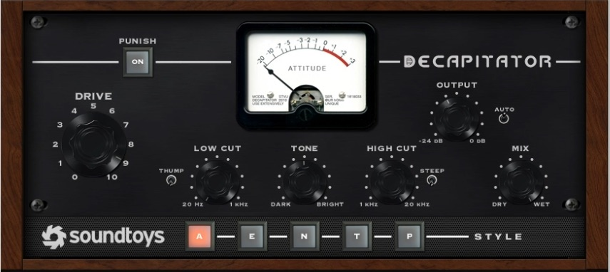

<iframe width="560" height="315" src="https://www.youtube-nocookie.com/embed/LrzPMKg4dyU" frameborder="0" allow="accelerometer; autoplay; encrypted-media; gyroscope; picture-in-picture" allowfullscreen></iframe>

This article is an introduction to most of the main effects used in audio production and mixing. The goal here is to give beginners a bird's eye view of the effects used in audio production and a basic framing of how/when they are used.

The video above gives demonstrations of the effects and the article below gives further explanations. 

##EQ

EQ is the most important tool used in mixing and mastering. When you want something to sound more pleasant or take up a certain space in a mix, EQ is generally what you'll need to use. 

**EQ**ualization (EQ) is the boosting/gaining or cutting/attenuating of frequencies. For example, if your song sounds too muddy, in other words the low frequencies in the mix don't sound right, you might use EQ to remove some frequencies in the bass and/or kick drums. 

It will take time to develop your ears to hear how and/or when you should use EQ to fix or improve a sound. 

Luckily, Music Sequencing has an article that goes much deeper into using EQ. You can read it <a href="/article/eq-essential-techniques">here.</a>

##Reverb

Reverb is used to set a sound in a certain space. When a sound has no reverb, we say it is dry, when a sound has a lot of reverb, we say it is wet. 

You can use a reverb to make something sound like it is in a cave, a famous concert hall, or simply give the sound a unique depth. 

In all likelihood you will want to use reverb on every single mix, oftentimes a few different reverbs for different elements.

Reverbs come in a lot of different flavors. Want to know more? <a href="/article/reverb-essentials"> Read this guide</a>. 

##Delays
Delays are like echoes that come in two main flavors, short and long. 

###Short Delays
Short delays can be used to make a sound bigger or give it a strange or unique vibe. 

###Long Delays
Long delays are sometimes used as an effect that is right in front of the mix, like in Pink Floyd's song "Us and Them".

Often times long delays are used more subtly to help fill in the space of mix. Listen closely to modern productions and many times you'll hear long delays on different elements giving depth in a manner different to reverb. 

##Gates
"Gate" is a great name for this effect. Essentially if a sound is below a certain volume threshold, then the gate will turn off the volume entirely. When the sound is loud enough, the gate opens and we will hear the sound. 

Gates can be found all over the place, on your cell phone, not sending sound when a person isn't talking, or a baby monitor, not sending the sound of a nursery unless the baby get's loud. 

In audio production you might use a gate for a practical reasons or creative once.

One practical reason to use a gate is if you have background singers singing throughout a chorus and you don't want to hear them breathing/just the mic sound when they aren't singing. A gate will eliminate that sound but allow you to hear them singing. 

A creative use of a gate would be on a reverb. <a href="/article/mix-drums-like-phil-collins">Check out how in this tutorial.</a>

##Distortion

Distortion can heavily vary in both flavor and use. 

Types of distortion include fuzz, tape, solid-state, tube, bit, and more.

Distortion can be heavily used to create that fuzzy or destroyed sort of sound, like in metal and rock guitars for example. 

When used subtly distortion can simply be used to color the sound in a pleasant way.

Distortion can also be a bad thing. If you record a vocal and someone yells into the mic when you weren't expecting them too, you might get some crappy sounding distortion that will be very difficult to work with.

##Tremelo, Chorus, Phasers, Flangers 
You can hear all these effects starting [here in the video.](https://youtu.be/LrzPMKg4dyU?t=287)
###Tremelo 
Tremelo is the volume going up and down over time. 
###Chorus
Chorus gives the effect of more than one instrument playing. It does this by duplicating the signal sent to it and delaying and detuning the duplicated signal slightly.
###Phasers
Phasers also duplicate and detune a signal like Chorus, but they add a sweeping filter to the sound. 
###Flangers
Flangers are like phasers and chorus, but they change the way the duplicated signal is change over time. (Might be best to [listen if you haven't yet.](https://youtu.be/LrzPMKg4dyU?t=287))

##Compression
Compression is often misunderstood and misused. 

Compressions can solve problems like overly dynamic recordings. Compressors turn down the dynamics according to how you set them. This can be a good thing, by making something more even or maybe more punchy, but can easily be turned into a bad thing. 

The incorrect use of compression can make something sound dull, flat or lifeless. 

When using compressors make sure to level match the uncompressed sound against the compressed sound so you aren't getting fooled into thinking the louder signal is the better one. This is demonstrated in the video [here](https://youtu.be/LrzPMKg4dyU?t=405).

##Limiters

Limiters are compressors set to extreme settings. They aggressively cut off dynamics. 

A very common use of a limiter is as the very last effect on the master bus of a mix or in a mastering chain. The limiter will catch any dynamics that are too loud and chop them off to prevent the sound from distorting(in a bad way).

##Others
There are other effects not mentioned in this article, just FYI. Let me know if you're interested in hearing about them. 

##Take Away
Before you use an effect a good rule of thumb is to ask yourself "how am I trying to alter the sound?". If you have a solid idea of the sound you are trying achieve you'll have a much better chance of choosing the correct effect and dialing in the settings. 

All the best. 