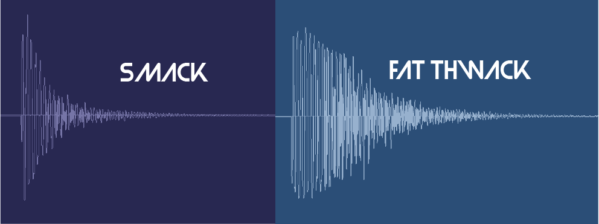
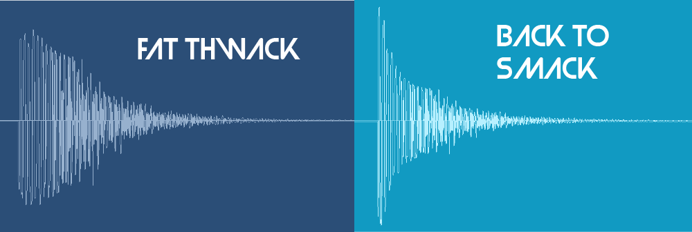
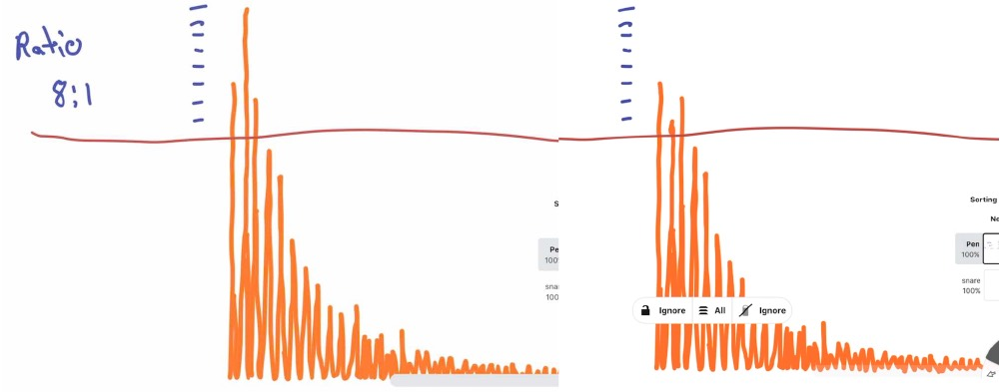
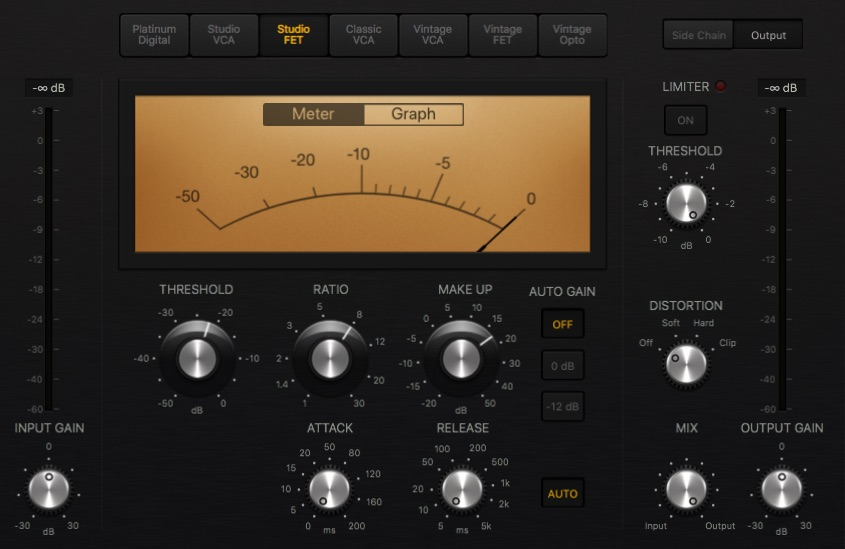
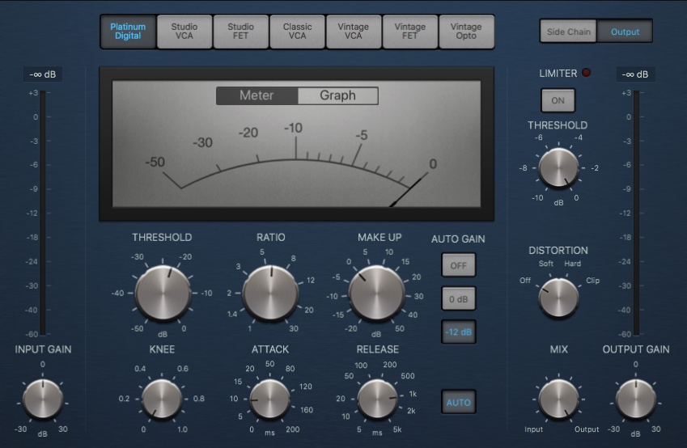

<iframe width="560" height="315" src="https://www.youtube-nocookie.com/embed/TsMipbWosLU" frameborder="0" allow="accelerometer; autoplay; encrypted-media; gyroscope; picture-in-picture" allowfullscreen></iframe>

Compression has got to be the most misunderstood tool in audio production. I hope to do my little part to help change that with this article and video. 

<!-- With compression you can adjust the peaks and valley's of levels . The result might sound fatter or punchier, more even or less even.  -->

Compression can simply be explained as an “automated volume fader” or dynamic tool, but does that really clarify how to use it? To muddy the waters further, a compressor set the wrong way might do exactly the opposite of what you want it to do.

A big part of learning how to use compression is a lot of listening and experimenting. Hopefully after this article you’ll have at least a conceptually understanding of exactly how a compressor affects sound. 

##Let's Focus Up

To make things simpler, we’re going to compress one thing super hard so it’s very clear how the compressor is working and how the compressor's parameters are used to achieve a desired result. 

We’re going to compress this snare hit and turn it from a quick smack to a big fat thwack!

Like so 

To solidify the dynamic nature of compressors (pun) we’ll then take that compressed big fat thwack snare and use a compressor to turn it BACK into a more quick smack sound. 

##The Objective

To get that big thwack our objective is to decrease the difference from the highest peaks to the lower peaks. 
All the higher peaks are right at the beginning of the hit and the whole snare hit happens very very fast. 
Keep that in mind as we start going through the controls. 
##The Compressor's Controls (or Parameters)

###Threshold 
Threshold is the point at which the compressor starts compressing. If you look at your compressor's gain reduction meter and see no gain reduction, then the whole signal is below the threshold. Turn down the threshold until you see gain reduction on the meters. 

After I initially set a threshold to get around the gain reduction I think I'll want, I'll often start adjusting other parameters and then return to adjust the threshold to taste. 

###Ratio 
Technically speaking, the ratio is how much the signal is getting compressed above the threshold. The higher the ratio, the more compression. 
 

Here's a before and after picture of how an 8:1 ratio might affect that highest middle peak.

####How do you choose a ratio?

First think to yourself, am I trying to drastically reduce dynamic range? Are there some peaks that are very loud verses the rest of the sound? Then you might choose a higher ratio like 8:1 or get into limiting ratios 10:1, 20:1 and Infinity:1. 

Are you just trying to smooth things out a bit? Maybe try 2:1 or 3:1. 

Somewhere in-between, hey, why not try out good old 4:1 or 6:1.  

You’ll get more of an instinct for choosing a ratio as you listen and experiment more...it only takes a couple seconds to change the ratio and listen if it is better one way or another. 

###Attack 
Attack, technically speaking, is a rate at which gain reduction is applied after the signal crosses the threshold.

Gregory Scott, founder of Kush Audio explains attack this way in <a href="https://www.attackmagazine.com/features/columns/gregory-scott-demolishing-the-myths-of-compression/" target="blank">Attack Magazine</a>.

**"Attack is the length of time it takes a compressor to apply roughly two-thirds of the targeted amount of gain reduction."**

####Attack in Practical Terms

Let's say you set the attack to 100ms. Most of the snare hit used in this tutorial takes place in less than 40ms. The meters on the compressor will show gain reduction but it isn't reducing the initial big transients that we want to grab to the degree we want.

If you have a very short sound, like a snare sidestick, with a long attack time, the compressor might not be doing anything at all to compress the signal. That is unless...

Unless you have a release time sooo long it keeps the compressor reducing gain all the way to the next sidesnare hit. 

So what's release?

###Release

Release is like the inverse of attack. Attack is reducing the signal at an increasing ratio over time until it hits your specified ratio, when the compressor starts to release, it is reducing the compression ratio until the compressor is no longer applying gain reduction. 

So to go back to our sidestick scenario. Let say there are two sidestick hits 200ms apart. 

The first sidestick hits the compressor, it goes above the threshold telling the compressor it should start applying gain reduction. 

BUT...let's say you set the compressor's attack to 100ms and the release to 5000ms. 

The compressor is not going to reduce the first sidestick because it wasn't attacked fast enough, however, the compressor was fed a signal above the threshold so it starts to do gain reduction, and it will keep reducing gain until we get to 5000ms.

Still with me?

The second sidestick was only 200ms away from the first, so the compressor has not yet stopped doing gain reduction. It has not been released. 

The end result is the second sidestick will sound quieter, not because ***it*** triggered the compressor, but because the first sidestick triggered the compressor and the release was so long the compressor has not stopped gain reduction.

Jesus I hope that's not too boring and clear enough. 

###Makeup Gain 

When you compress something, it will sound quieter. To compensate for this most compressors include a makeup gain. 

One problem people have when using compressors is they set the makeup gain higher than the original signal (or the compressor does it automatically for them) making the sound louder but not necessarily better. 

**It's best practiced to match the level of the compressed signal and uncompressed signal to compare if the compressor is affecting the sound in a good way instead of just making things louder.**

###Other Controls
Compressors might have other controls like knee, or filters, we'll talk about them another time, let's master the fundamentals first.

##Mission One
How do we make this fat snare? 

Let's take a look at where we are again and where we want to be. 

As mentioned above, the meat of this snare takes place in less than 40ms. That should give you the idea that the attack and release probably got to be faster than that. 

In order to get a bigger body we are reducing the dynamic range of the snare hit. All of the very loud parts of the snare take place in the first 3ms. In other words, REALLY FRIGGEN QUICKLY.

**Quick pause** Normally I have no idea of how many milliseconds a sound is. I measured this out here for edumacation purposes.

If you look at the picture of the "smack" snare above, i.e. the uncompressed snare. You'll see there is a sharp drop in level very quickly. 

Because the sound get's very quiet quickly after the first loud smack, we want to make sure that the compressor is compressing for the shortest amount of time possible so we don't compress any of the body of the snare. 

Therefore, we also need a very very fast release. 

In the video at the top, I set the ratio to 8:1. It's a good amount of reduction, which we need because the difference between the highest peaks is so great. I didn't do 20:1 for example because I still wanted to maintain some sort of "smack" or initial hit in the sound. 

Here's how the settings on the compressor ended up. 

Attack and release as fast as possible. Needing a good amount of makeup gain to restore the level. 

This is a crazy amount of compression, but sometimes exploring the extremes helps people hear the subtleties later on. 

##Mission 2: Back to Smack

Let's look at a refresher of what we are going for now. 

Now's a good time to test yourself to see if the information is making sense or you just think it is. 

Take a guess at around what the attack should be to go from the fat thwack on the left to the more smack sound on the right. Hint: Look back at how long I said the snare hit is and how long I said the initial loud peaks were.

... 

...

...

So in order to get the sound closer to what we started with, we don't want to attack the first initial peaks, but everything after them.

In the video I played with this idea on the fly and these were the settings I came up with. 

So you can see the attack is around 10ms. Slow enough to let the initial transients through but fast enough to start reducing the body of the snare hit again. The release doesn't necessarily need to be as long as I set it, but it needs to be long enough that the compressor is still reducing the body to some extent through the end of the hit. 

###Back to the beginning
Now imagine you wanted to make the original, uncompressed snare fatter, but you set your compressor up with an attack time at 10ms as I just did in "Mission 2: Back to Smack". You might actually INCREASE the dynamic range doing the opposite of what you wanted. 

## Until Next Time
This is not the end. Only the beginning. 

My hope here was to use these extreme examples to demonstrate what a compressor can do and how their controls make it happen. 

I'll be writing more articles and making more videos on compression in the future. There's so much more stuff that needs squashing and explaining. 

##Private Lessons

I teach private lessons in mixing, producing and music theory online where we can go over your mixes or discuss whatever you are having problems with..At the moment I'm offering a free first lesson as schedule allows :) You can contact me at <a href="mailto:lessons@musicsequencing.com">alex@musicsequencing.com</a>.

Have a great day, 
Peace.