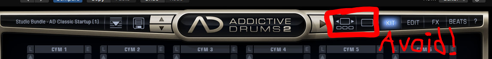

<iframe width="560" height="315" src="https://www.youtube-nocookie.com/embed/LqEMxhItMi0" frameborder="0" allow="accelerometer; autoplay; encrypted-media; gyroscope; picture-in-picture" allowfullscreen></iframe>

In this review of Addictive Drums 2 I take a look at what makes it different from using regular drum samples and do an overview of the plugin. 

##What's Good About Addictive Drums 2 

###Addictive Drum's Realism

For example, when you play a snare in Addictive Drums 2 you don't hear 1 sample, you might hear that snare through the overhead drum mics and room mics along with a blend of top and bottom close snare mics. 

You can get incredibly realistic sounding drums with Addictive Drums because it is setup up how a recorded drum set would be setup. They've done a great job of mimicking things like mic bleed from different drums to go the extra mile into getting a realistic sound.

###The Midipacks
In my opinion the midi packs here are much better than anything you get in regular loop packs because they are completely customizable. It's midi, don't like a note? Delete it.

Not only are the grooves awesome but you can completely change the sound of any kit piece and mix them to fit your music. Invaluable for creating music quickly for library or film composers.  

##What's Bad About Addictive Drums 2

###Presets
What I neglected to show in the review video of Addictive Drums 2 was the presets. Saying they're bad would be dramatic. However, I almost never use them. The recorded sound of the drums are so fantastic it's usually easier to get the results I want starting from scratch.

###User Experience
The user experience for Addictive Drums can suck. It isn't cohesive. There are 2 windows, the Explore and the Gallery, where if you click to preview a kit, it will overwrite your current kit without asking. Then there is no going back, you've lost your work. When you are in the preset menu however, you have to double click to load a kit even though it shows the kit changing on the Addictive Drums interface in the background.

<small>Don't click these and open the explore and gallery views unless you are interested in buying more kits.</small>

These problems could very easily be fixed by having a menu pop up that asks if you want to change the kit before changing it. What would also be nice to have is a back button, to go back to the kits you had loaded before. 

Maybe these things have been addressed in an update but I think I'm up to date...I don't know, they don't tell you in the plugin and it isn't clear on their website.

##Getting Addictive Drum 2

Addictive Drums 2 is just as much about the interface as the kits. If you buy the "Basic" for €170 it comes with 3 kits, chosen for you. 

You can choose to buy a "Custom" version also for €170 where you choose the kits yourself. This is what I'd suggest you do. Listen to all the kits and pick what you need. There is always the option to buy kits individually later too. 

To get Addictive Drums 2 checkout their site, <a href="https://www.xlnaudio.com/products/addictive_drums_2" target="blank">XLN Audio</a>

