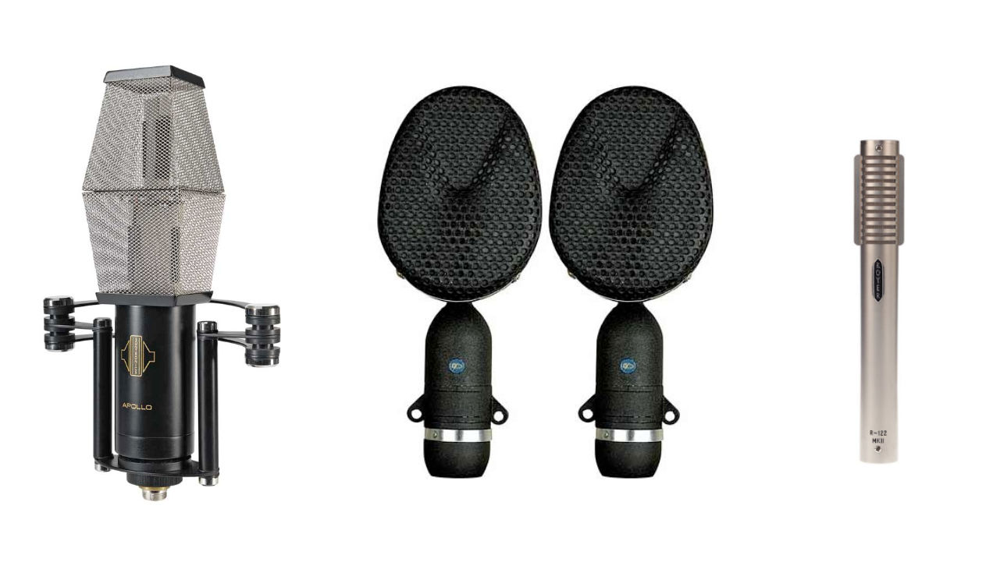

<iframe width="560" height="315" src="https://www.youtube-nocookie.com/embed/b-LtSElPnHg" frameborder="0" allow="accelerometer; autoplay; encrypted-media; gyroscope; picture-in-picture" allowfullscreen></iframe>

The right mic choice = a better recording. A little mic knowledge can go a long way. Here's the basics anyone working in a studio should know. 

## The 4 Types of Microphones

1. Dynamic Microphones
2. Large Diaphragm Condensers
3. Small Diaphragm Condensers
4. Ribbon Microphones

Here's what you should know about each one.

## Dynamic Microphones

Dynamic mics are usually pretty hardy and can be used on a lot of different sources. They tend to be cheaper, record less details, and can be great for both close micing and micing things at distance. 

If you only have a $100 to buy a microphone and you will be recording more than just vocals, I recommend you get the [Shure SM57](https://amzn.to/2YXSNDk). One of the most versatile and famous mics in the world. A classic for a reason.

### What Are Dynamic Mics Good For?

- Live performances
- Snare drums
- Guitar Cabinets 
- Vocals
- Can be used on pretty much anything

### Great Dynamic Mics
- [Shure SM57](https://amzn.to/2YXSNDk) - $99
- [Shure SM7B](https://amzn.to/30Rc4II) - $399

## Large Diaphragm Condensers

Large Diaphragm Condensers or <strong>LDC</strong> mics are often the best choice to record vocals. They record a lot of detail and nuance but can be fragile and expensive. 

Both Large and Small Diaphragm condensers microphones usually will require their own power source or phantom power from a mic preamp or audio interface.

### What Are LDC Mics Good For?
- Vocals
- Room Mics
- When you want to capture the fine details

### Great Large Diaphragm Condensers
#### Some Budget LDCs
- [Audio Technica 2020](https://amzn.to/2WtcdT3) - $99
- [Rhode NT1](https://amzn.to/2VXiaU7) - $269

#### Some Quality LDCs
- [Audio Technica 4050](https://amzn.to/2HKzEz1) - $699
- [AKG C414](https://amzn.to/2EJBoqv) - $948
- [Manley Reference Mic](https://amzn.to/2Z0jQOK) - $2999

## Small Diaphragm Condensers

Small Diaphragm Condensers also will capture a lot of detail but are used a bit differently than LDCs. Typically you might use a Small Diaphragm condenser to mic a source at a distance of a couple feet or more. They are great for capturing the sound of a room or collection of sounds in fine detail. 

### What Are Small Diaphragm Condensers Good For?
- Room Mics
- Drum Overheads
- Acoustic Guitar (Usually closer)
- Recording Live Vocals (Depending on the particular mic)
- Hi Hat (Close Mic'd)

### Great Small Diaphragm Condensers
- [Line Audio CM3](http://www.lineaudio.se/CM3.html) ≈ $250 (Amazing for price, order direct from Sweden)
- [Rhode NT5 Matched Pair](https://amzn.to/2WrR5g8) - $426
- [Neuman KM 184 Pair](https://amzn.to/2Mx0fV1) - $1500

## Ribbon Mics

**Warning** : If you send Phantom Power to a ribbon mic you could destroy it. Something you need to know.

Beyond potentially being destroyed by phantom power the characteristics of a ribbon mic can be thought of as somewhere between a condenser mic and a dynamic mic. They can be great on everything from vocals to drum overheads depending on the particular ribbon mic you are using. 

### What Ribbon Mics are Good For (REALLY Depends on the Mic)
- Guitar Cabinets (Royer R121)
- Drum Overheads (Coles 4038)
- Piano, Strings (Apollo)
- Vocals (Various classic ribbons)

### Great Ribbon Mics
- [Coles 4038 Pair](https://amzn.to/2MkcwMl) - $2549
- [Royer R121](https://amzn.to/2HK86Kj) - $1295
- [Apollo by Sontronics](http://www.sontronics.com/apollo.htm) ≈ $1800

## Try them All!!!

This article is meant to be an overview of the mic types and what they are generally used for. Experimentation with microphone types and placement is often where you can find the most interesting results. 

If you have any questions or comments you can write down in the forum thread embedeed below. 

#### Consider supporting Music Sequencing by checking out what's in the [store](/store). 

#### If you are interested in improving your producing skills, checkout out what's in the [projects page](/projects).