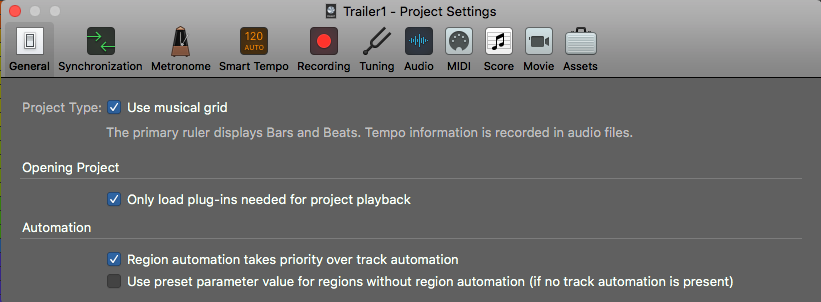
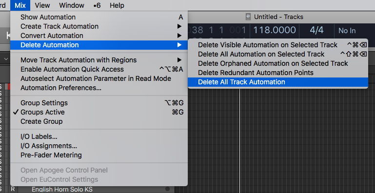
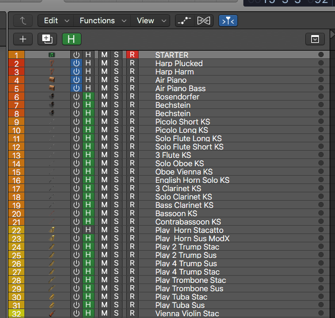
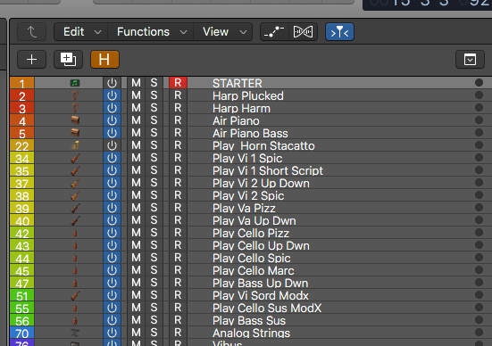

<iframe width="560" height="315" src="https://www.youtube-nocookie.com/embed/_VHkfcC0eAc" frameborder="0" allow="accelerometer; autoplay; encrypted-media; gyroscope; picture-in-picture" allowfullscreen></iframe>

If you've recently upgraded to Logic Pro 10.4.5 you may noticed something a little different about how your projects are loading. 

When you click on an instrument track after opening a project it might take a second for the plugin to load up. This is because **the plugins on tracks without audio or midi regions are no longer automatically loaded** when you open a session. This is called "Dynamic Plug-in Loading" and it might seem annoying at first but it is an amazing new feature. 

**You can turn off dynamic plug-in loading** by going to File -> Project Settings -> General and unchecking the box that says "Only load plug-ins needed for project feedback"...but consider some reasons **why you shouldn't turn of dynamic plug-in loading**. 

## Dynamic Plug-in Loading is Magic

Image you are working on an album. 

You create your first project, loading a bunch of drum samples, software synthesizers, sample instruments, do some sound design and set up all the routing to to mix it together. 

When you move on to your second project, you can take your first project, do a "Save As" to a new project (call it Second Track or whatever), and in the new project, **clear out all the regions / automation information from the first track project.**

### Clear Out the Project 

1. Select All (CMD a) -> Delete 
2. In the top menu go to -> Mix -> Delete Automation -> Delete All Track Automation

Now the project is cleared out but you have access to all of the sounds from the first project (if you want them), all the routing and plug-in chains are all ready to go.

## The Template GROWS!

**Here is the magic**. If you close and reopen the project, it will open almost instantly (compared to having load all the plugins). All of the plugins you used in the first project are easily / nearly instantly accesible BUT they won't take up any processing power unless you actually use them in the next project.

Logic now has a track count of 1000 audio tracks, 1000 instrument tracks, 1000 aux channel strips and 1000 external midi tracks. 

## Hide Anything You Aren't Using

So by the time you get to your 10th song, you could probably still fit in every instrument you have used from all of the projects into 1 master album project template. 

**This project will LOAD INSTANTLY AND ONLY TAKE THE CPU REQUIRED TO PLAY THE PROJECT** 

Still, if you are looking at all of those instruments all the time it would be a pain. To hide tracks you aren't using just press "H" on your keyboard or the "H" button (as show in the picture below) and it will show you the "Hide" button on the track. When a it's green it means the track will be hidden when you press the "H" button again". 

<!--  -->
<figure class="image">
  
  <figcaption>Showing Hidden Tracks</figcaption>
</figure>
<figure class="image">
  
  <figcaption>Hidden Tracks Are Hidden</figcaption>
</figure>

## This is huge for Everyone!

This gives the power of anyone from a Mac Mini to the new Mac Pros to build a MASSIVE TEMPLATES that loads (near) INSTANTLY!

If you do find the little bit of load time for the first time you use an instrument a little annoying, there is a little hack you can do to get it to load with the project.

## Instead of Turning off Dynamic Plug-In Loading
 
Just put an empty midi region on the track and it will automatically load when you open the track.

You still will have the magic of dynamic plug-in loading across the project but also your favorite sounds will automatically be loaded. 

