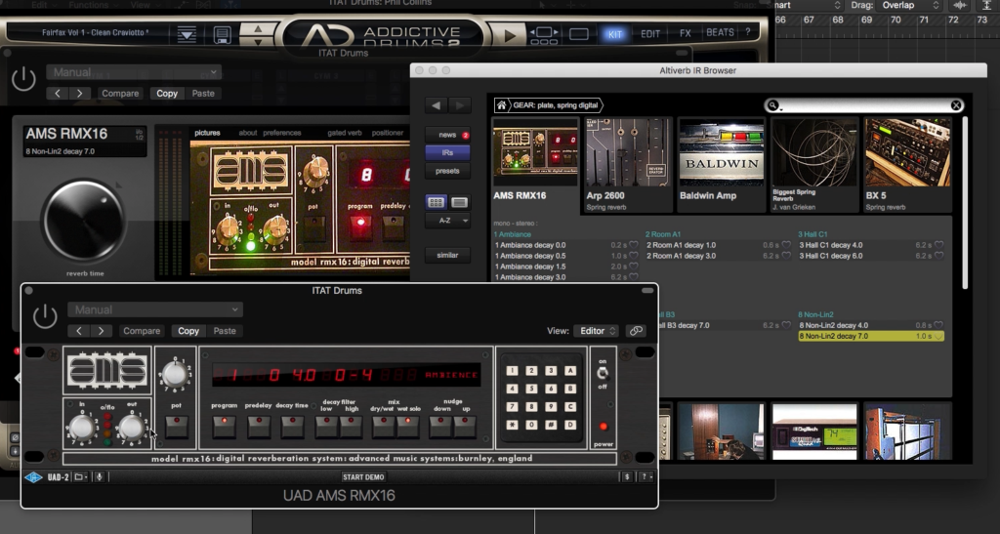
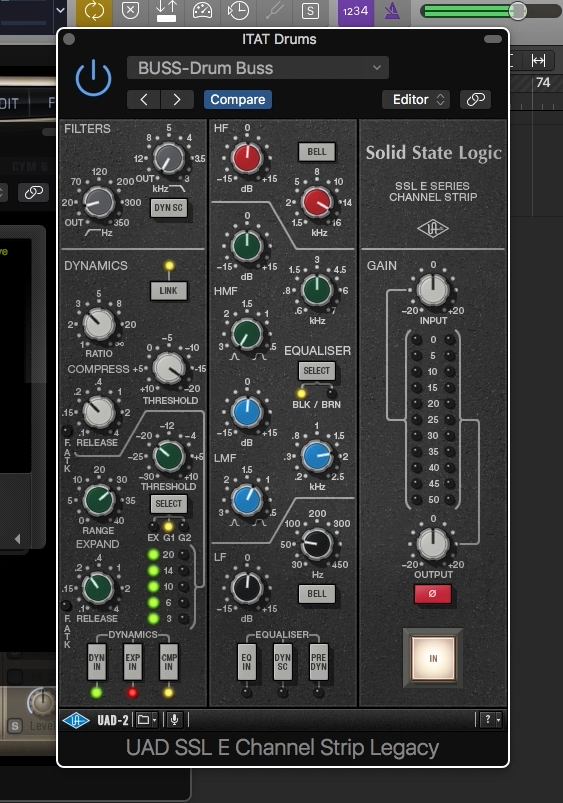
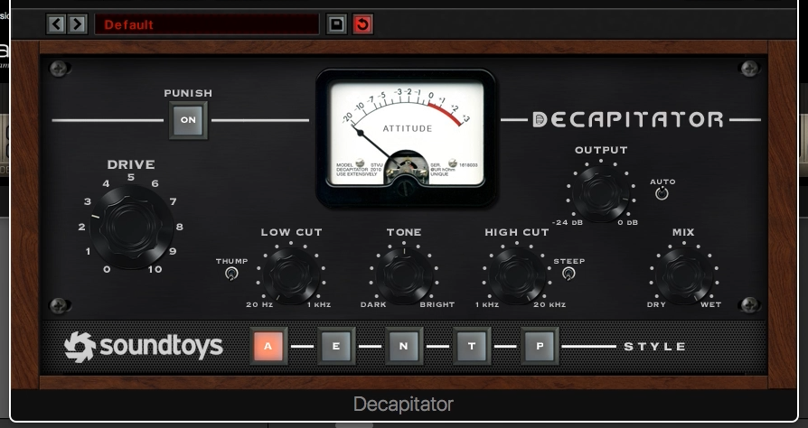
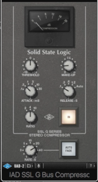

<iframe src="https://www.youtube.com/embed/X1S9RqgFHy0?ecver=1" width="560" height="315" frameborder="0" allowfullscreen="allowfullscreen"></iframe>

 The basic concept to getting big roomy drum sounds like the classic Phil Collins drums from "In the Air Tonight" comes from compressing a reverb onto the drums and then gating the result. Mixing drums like this can yield big powerful drum hits yet still leave space for the music around the drums.

Here is the overview of what is in the video with some time çstamps included as always.

<a href="https://www.youtube.com/watch?v=X1S9RqgFHy0&amp;feature=youtu.be#">0:47</a> - Raw vs with Plugins
<a href="https://www.youtube.com/watch?v=X1S9RqgFHy0&amp;feature=youtu.be#">1:44</a> - Adding Reverb AMS RMX16
<a href="https://www.youtube.com/watch?v=X1S9RqgFHy0&amp;feature=youtu.be#">2:43</a> - History Of How the Sound Came
<a href="https://www.youtube.com/watch?v=X1S9RqgFHy0&amp;feature=youtu.be#">3:40</a> - Adding The SSL Compression and Gate
<a href="https://www.youtube.com/watch?v=X1S9RqgFHy0&amp;feature=youtu.be#">4:26</a> - Explaining the Gate
<a href="https://www.youtube.com/watch?v=X1S9RqgFHy0&amp;feature=youtu.be#">5:56</a> - The Decapitator
<a href="https://www.youtube.com/watch?v=X1S9RqgFHy0&amp;feature=youtu.be#">7:17</a> - Adding The SSL bus compressor
<a href="https://www.youtube.com/watch?v=X1S9RqgFHy0&amp;feature=youtu.be#">8:15</a> - Raw to Everything One at a Time

<h3 ></h3>
<h3 >The Reverb - AMS RMX16</h3>

In this picture you are seeing two different plugin emulations of the AMS RMX16 reverb. The version in the back is Altiverb and it is what you can hear in the video, the one in the front is UA's emulation of the AMS RMX16. The important thing is to grab is the Non-Lin2 decay, I believe on the original unit it was in the number 8 bank.

AMS designed this reverb to be an exact replication of the room sound inside of Townhouse Studio 2's live room where "In the Air Tonight" was recorded. <a href="http://www.musicradar.com/news/drums/classic-drum-sounds-in-the-air-tonight-590970" target="_blank" rel="noopener noreferrer">According to Hugh Padgham</a>, who co-produced the album, the majority of the drum sound comes from one room mic, which is how the drums are processed in this video.

They discovered the sound when working on a Peter Gabriel album that Phil Collins was playing drums on. The SSL console in the studio had a mic placed in the middle of the live room that was super compressed so musicians could talk to the people in the control room without having to yell into the mics they were using on their instruments. This amazing drum sound was basically discovered by accident when the live room talk back mic was left on while Phil Collins was playing.

To recreate this sound we are putting the reverb first in the chain because that is how it was recorded, one mic with a ton of room noise. We have to put the drums into the room before we compress them.
<h3 ></h3>
<h3 >SSL Console - Compression and Gate</h3>

The SSL console was basically brand new when they were making "In The Air Tonight" and lucky for everyone who loves this sound, SSL put a gate right on every channel. Having the gate right there allowed the engineer to just press a button as opposed to patching some outboard gear, thus they discovered the effect of having the sound sucked away from compressed roomy drums, leaving a bunch of space for the music.

Hearing the drums by themselves probably sounds a bit weird and processed, but all that space in the middle is what makes the drums have such a big impact when they come in and then leave. The two major forces in music are sound and silence, these drums do both.

The compression brings up the sound of the reverb around the drums closer in level. It's almost as if he's not only playing the drums but playing the room. The combination of this specific reverb and the SSL compression and gate are what make this Phil Collins drum sound.
<h3 >Decapitator</h3>

At this point in the chain I just felt like the sound wasn't quite there so I decided to Decapitate it. Soundtoys' Decapitator plugin is known as one of the best plugins to add warmth to digitally.

This is more of a personal preference but I think it adds to the authenticity and overall ascetic in this situation. Perhaps the newer versions of UA's SSL channel strip with preamp emulation in it would have a similar effect, I don't know because I don't got it. The idea here is to warm up the sound a bit.
<h3 ></h3>
<h3 >SSL Bus Compressor</h3>

Last in the chain is the good old SSL bus compressor to really tie the room together. The SSL bus compressor is famous for compressing all sorts of buses, especially drum buses. Adding a bit more compression on here definitely helps bring everything together, it really glues the reverb on with the drums plus two compressors can be better than one.  Another benefit is we get more of the SSL sound in there.

If you use Ableton you'll be happy to know that there is a built in emulation of the SSL bus compressor called The Glue that is awesome. Waves makes a version and so does Native Instruments and probably a bunch of others.

That's how we get to that Phil Collins "In the Air Tonight" drum sound today. This is a great effect that can be heard in modern music all the time. Try it on your drums, try it on other stuff, have fun with it buddy.