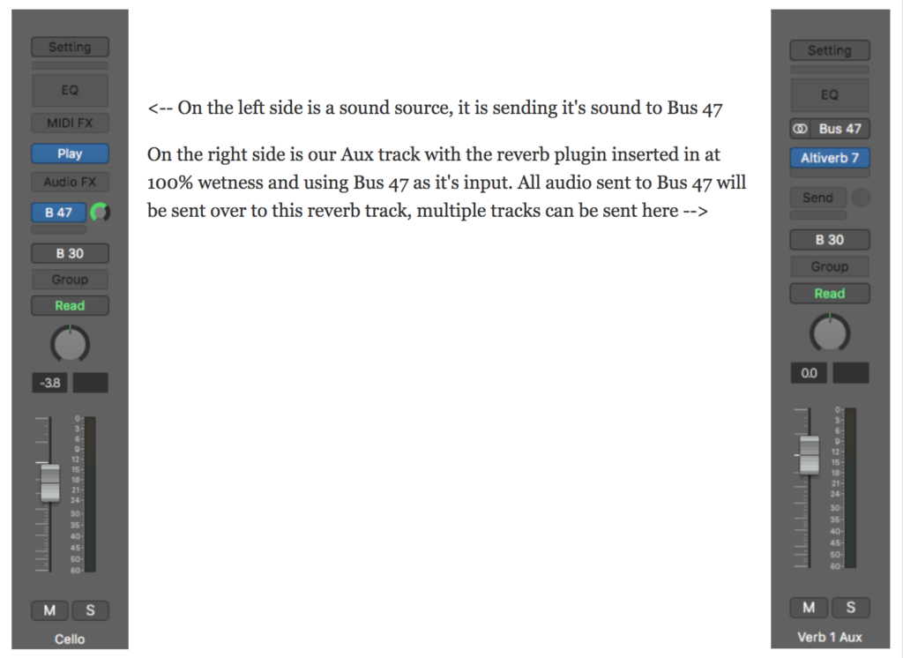

 

Reverb is usually the first effect someone new to producing music plays with. Instantly you'll hear how a vocal sounds soooooo much better after throwing on some reverb but it is deceptively hard to actually get it right. Some pro mixers will spend ages fidgeting with reverb to find the magic spot where it works best. <strong>Reverb is THE vital effect</strong> for putting elements in the right dimension and giving a sonic space to your mix.

When you add reverb to something in your mix, you should be asking yourself some questions.
<ol>
 	<li><strong>Where do I want this element in the mix?</strong> - If you want something to sound right next to the listener's ear, then you don't want a lot of reverb or a long reverb tail. On the other hand, if something needs to feel like it's a million miles away then you need to drench it in reverb, probably with a long reverb tail.</li>
 	<li><strong>What type of reverb would work best?</strong> - Most reverbs sound like crap. You have to hear some good quality reverbs before you know the difference. Assuming you have some good quality reverbs to choose from, you might want to put the sound in a cathedral, a concert hall, or add the distinct sound of a plate reverb. These reverbs are vastly different and will color your mix in very different ways.</li>
 	<li><strong>Will other elements benefit from this reverb?</strong> - Sometimes you might want to add a certain reverb to the entire mix. Other times you might want to add reverb to a group of instruments, like all of your percussion for example and other times you might want to use a specific reverb for only one element, like on the lead vocals or a snare drum. Chances are, you will want to set your reverb up as a send so you can add different elements to the verb. If you will use your reverb for only one element, then you could set your reverb up either as a send or place it directly onto your track.</li>
 	<li><strong>Could the reverb benefit from any additional effects or mixing?</strong> - It is very common to EQ your reverbs and a lot of reverbs have EQs built in to make this process easier. Many times you will want to remove some of the low end out of a reverb so your mix doesn't get too muddy. You might find some surprisingly cool results from adding distortion, delays, or other effects to your reverbs too, don't be afraid to experiment.</li>
</ol>
<h2 >Types of Reverb</h2>
The five types of reverbs, in the order they were invented are, 1. Natural 2. Plate 3. Spring 4. Digital and 5. Convolution Reverb. There is some cross over of the different types too. Digital reverbs, for example, are mostly used to emulate the natural reverb found in a concert hall or the metal sound of a plate reverb rather than create it's own "digital" sound.
<h4 >1. Natural Reverb</h4>
Natural reverb is what you hear everyday walking down a long stony hallway to yelling into that abandoned missile silo behind your house. The lingering sound that comes from the noise bouncing around the room is where the whole reverb effect is derived from. Concert halls have always been built to have a balanced sound with a great reverb tail so when the orchestra is playing the sound remains a few seconds longer after leaving the instrument mixing the orchestra together and giving a pleasant decay when everyone stops playing.

Studios were later built to have a nice "room sound" but the reverb tail in a studio is usually much shorter than a concert hall or missile silo. When early recording engineers decided they wanted really long, thick, reverbs they started building entire rooms for it. Sometimes they would record directly in the "echo chamber" and other times they would set them up as a send for an "artificial" reverb, like this (push play).

&nbsp;

<iframe src="https://www.youtube.com/embed/EErrKkgy8Ck?start=66" width="560" height="315" frameborder="0" allowfullscreen="allowfullscreen"></iframe>

&nbsp;

Fun fact, the first time anyone ever added "artificial" reverb like this was in 1947 when Bill Putnam Sr. put up  some speakers into the studio bathroom for a record by The Harmonicats called "Peg o' My Heart". It was a yuge hit and major breakthrough in recording.

Later on, digital and convolution reverbs came about to do the job emulating the natural reverb you might find in a bathroom, concert hall, studio, echo chamber or wherever, thus eliminating the need for the speaker/mic send reverb system.
<h4 >2. Plate Reverb</h4>
In 1957 a company called EMT came out with the first plate reverb called the EMT 140 and holy crap did it sound good. Basically, EMT built a giant, 600 pound, metal plate and hook up some electronics to it. When you send signal down the electronics, it vibrates the plate, the plate rings out, and the effect is a really interesting reverb.

<iframe src="https://www.youtube.com/embed/HEmJpxCvp9M?start=16" width="560" height="315" frameborder="0" allowfullscreen="allowfullscreen"></iframe>

&nbsp;

The EMT 140 can be heard on tons of records from the likes of the Beatles and Pink Floyd to many modern artist. Lots of studios still have these plates lying around to this day. Plates make a pretty distinct sound that can be really great on your lead vocals. Luckily, for those of us who don't have room for a 600 pound plate of metal, digital reverbs can emulate plates and convolution reverbs have sampled plates (including the EMT140 specifically)...we'll get into that in minute.
<h4 >3. Spring Reverbs</h4>
Spring reverbs are like the trashy cousin of plate reverbs. The principal is basically the same except, instead of sending the sound down to a giant plate, it goes to spring. Spring reverbs really caught on because they are so very, very, cheap to make. Here's what they sound like.

&nbsp;

<iframe src="https://www.youtube.com/embed/EErrKkgy8Ck?start=197" width="560" height="315" frameborder="0" allowfullscreen="allowfullscreen"></iframe>

As you can hear, spring reverbs sound like springs. You might use a spring reverb if you are trying to emulate a classic 60s sound or you have some other specific effect in mind. That being said, spring reverbs generally aren't the most graceful sound, so for the most part, you can skip over them when you're trying to find a good reverb.
<h4 >4. Digital Reverbs</h4>
The first digital reverb, the EMT 250, came out in 1976. You might be asking yourself, "Hey, isn't that the same company that invented the plate reverb, the EMT140?" Why yes, yes it is. EMT just has a thing for inventing ground breaking reverbs I guess.

A digital reverb, at it's core, is a bunch of delays at different times. Technically, this is what all reverb is. Reverb is just sound bouncing off of things back into our ears at different points in time. Digital reverbs create this effect with digital circuitry. Digital reverb is where we first started seeing mimicry of other types of reverbs.

The designers of digital reverbs would adjust the delays in the circuits to try and recreate different plates, different concert halls, and sometimes even specific recordings as shown below.

<iframe src="https://www.youtube.com/embed/X1S9RqgFHy0?start=104" width="560" height="315" frameborder="0" allowfullscreen="allowfullscreen"></iframe>

Two of the most famous digital reverbs of all time are the Lexicon L224 and the Lexicon L480. To this day, many studios all over the world still use these 80s relics on recordings. Again, luckily for us, these classic 80s reverbs and many more can be found in plugins that either have algorithms to recreate the digital circuitry or have sampled the machines directly for use in convolution reverbs.
<h4 >5. Convolution Reverb</h4>
Convolution reverb is the sampler of the reverb world and impulse responses are the samples. Someone who wants to use a famous concert hall on their own recordings can go there once, set up some mics and take an audio sample of the room. Then they load up the impulse response inside of a convolution reverb where it will use algorithms to add the sampled reverb from the room onto whatever sound choose. You can pretend to put whatever sound you want in that concert hall.

Convolution reverbs are used to recreate the sound of real physical places, plates, springs and digital reverbs. With enough different impulse responses convolutions are basically all the different types of reverbs rolled into one package.

The quality of a convolution reverb is only as good as the quality of the impulse responses inside it. Chances are, your DAW will have a built in convolution reverb with some impulse responses (IRs) to choose from. If you want, you can look around the internet for free IRs, paid ones, or look up how to sample your own IRs for some custom reverbs to load into your DAWs convolution reverb.

My personal favorite reverb is <a href="https://www.sweetwater.com/store/detail/Altiverb7" target="_blank" rel="noopener">Altiverb by Audioease</a>. It is a convolution reverb with impulse responses from all of the most famous digital reverbs, plate reverbs, spring reverbs, concert houses, churches, cathedrals and a bunch of other weird stuff too for the hell of it, like water tanks, mausoleums and old toys. Yeah, it's super expensive for one effect, but unlike other effects like compression or eq, where I use a bunch of different things all the time, I don't need to use anything else besides Altiverb for my reverbs, seriously.
<h2></h2>
<h2 >Reverb Parameters</h2>
In addition to choosing a type of reverb, most plugin reverbs have a variety of different ways to further manipulate the sound of your reverb. I'll list and explain the parameters here and below there is another embed video to demonstrated the how the parameters affect the sound.
<ul>
 	<li><strong>Time (Decay Time, Reverb Time)</strong> <strong>-</strong> This is how long the "<strong>reverb tail</strong>" will last. Really short reverb tails can be under a second while longer reverb tails can be in the 6-8 second range and there are some super long reverb tails you might find, like some cathedral IRs for example, that will go past 10 seconds. Time is one of the most important parameters of reverb.</li>
 	<li><strong>Size</strong> <strong>-</strong> Size is similar to time in that, if you make it bigger, then the reverb tail will be longer. With the size the quality of the reverb will change as well. The "room" will actually sound like it's in a different space.</li>
 	<li><strong>Pre-Delay - </strong>Another vital parameter in reverb, pre-delay determines how much time there will be from when you hear the original dry signal to when the sound of the reverb kicks in. In real life, you usually will hear the dry source of sound before you hear all the times it has bounced of the walls. Experiment with your pre-delays a lot to get an idea of how it affects the sound.</li>
 	<li><strong> Shape -</strong> For certain digital reverbs you can control the "shape" of the virtual room, thus changing the sound of the reverb. It's a knob you just have to play with a bit to see if it makes things better or worse.</li>
 	<li><strong>Spread - </strong>This is how far across the stereo spectrum your reverb goes. At one extreme the reverb will be mono and the other will be stereo or beyond to extra reflections..</li>
 	<li><strong>Diffusion - </strong>Kind of like a thickness/smoothness knob. Play with diffusion to change the room sound as well. A room with low diffusion might be like a square marble castle room where the sound bounces straight back of the wall while a room with high diffusion might be a library with a lot of books to break up the reflections.</li>
 	<li><strong>EQ</strong> - Also known as color, low cut, high cut, dampening, brightness ect. are anything to deal with controlling the frequency responses of your reverb. If you don't have a built in EQ on your reverb, or you want to do some surgical EQ, feel free to throw an EQ on your reverb channel and EQ away.</li>
 	<li><strong>Mix - Wet</strong> <strong>is signal with reverb, dry is signal without reverb</strong>, and your mix will blend the two of them. If you set your reverb up on an aux track, you'll want to keep your mix at 100% wet, and you control the amount of reverb with your send, if that doesn't make sense, we'll get into it in the next section (it's also in the video).</li>
</ul>
Some reverbs might have a couple other parameters that you can adjust, or the ones above just called by different names but that list will cover the lion's share of the adjustments you can make to reverbs. Here is the demonstrations of some of these effects in Altiverb.

<iframe src="https://www.youtube.com/embed/EErrKkgy8Ck?start=466" width="560" height="315" frameborder="0" allowfullscreen="allowfullscreen"></iframe>

&nbsp;
<h2 >How to Set Up Your Reverb(s)</h2>
Generally you will use several different reverbs in your mixes. For example, you might have one reverb that you use only on your lead vocal, one you use only for your snare drum, then a couple different general purpose reverbs that you send different instruments to to add space, and lastly, a reverb that you add to your entire mix to put everything into one space.

For the most part, you will want to insert your reverb plugin on an aux tracks and use <strong>buses</strong> and <strong>sends</strong> to send your sounds <strong>to the reverb</strong>. The process for this is quite simple and once you do it a couple times, it'll be second nature. It goes like this.
<ol>
 	<li>Create an aux track</li>
 	<li>On your aux track, add your reverb plugin as an audio effect, make sure the mix is at 100% wet on your reverb</li>
 	<li>On your aux track, <strong>change the input</strong> to a bus. In the example below, I used Bus 47 (for no particular reason)</li>
 	<li>On your sound source (what you are adding reverb to) set up a send to the bus you chose as the input for the aux track, again, in the case I chose Bus 47.</li>
 	<li>Turn up your send to add more reverb.</li>
</ol>

You may have observed that the output of both tracks is set to Bus 30. This is a bit more advanced but so you know that is for the purpose of printing stems (stems are equal length audio files of all of your song's elements for mixing). If somebody else was going to mix my track, it is common to print reverbs onto a separate stem from it's source.

To do that, I would change the output of my reverb to a different bus, and record it onto a separate audio track so that the mixing engineer can decide if he/she would like to use my reverb or change it to his own. If that doesn't make sense, don't worry about it right now, that's a more advanced topic we'll get to on a different day.

Here is a video to show you how this type of reverb setup works

<iframe src="https://www.youtube.com/embed/EErrKkgy8Ck?start=435" width="560" height="315" frameborder="0" allowfullscreen="allowfullscreen"></iframe>

Having your reverb on a separate aux track has a few advantages.
<ol>
 	<li>You can send a bunch of sounds to the same reverb, effectively putting them in the same space.</li>
 	<li>You save processing power by using only one instance of a reverb rather than many.</li>
 	<li>You can print your reverb to a separate stem for more mixing flexibility when working with another mixer.</li>
 	<li>You can add different effects like EQ, delays and distortions that will only effect your reverbs.</li>
</ol>
<h4 >Inserting Reverb Directly Onto A Track</h4>
If you are the person doing the final mix of a track, there will be times when you want to insert a reverb plugin directly onto your track. When you do this, then you will want to blend in your reverb using the mix, input and output knobs on your reverb plugin.

Let's say that you want to add a distinct reverb that will only be on your lead vocals. Chances are you will want to insert the reverb last in your insert chain. This is because you want to have the nice sounding, mixed vocal, before you go bouncing it off a plate or around some room. Still...you might want to use a send.

On the other hand, there are times that you have a super dry sound that you want to really, really be drenched in reverb. In this case you might want to put your reverb towards the front of your effects chain and use a compressor to compress the dry sound and the reverb together, effectively making the reverb louder and the sound source quieter.

I show this technique in this sweet video about making some Phil Collins drums.

<iframe src="https://www.youtube.com/embed/X1S9RqgFHy0" width="560" height="315" frameborder="0" allowfullscreen="allowfullscreen"></iframe>

<h3></h3>
<h3 >Conclusion</h3>
That about covers it. As always, EXPERIMENT! Try new things, add delays to your reverb, go looking for wacky impulse responses, compress the crap out of your reverbs. Reverb is deceptively hard to get right but it is much easier to use if you start with a good reverb sound. Take some time and find some go-to reverbs that you can depend on to sound beautiful.

If you want to review most everything we talked about press play and watch the full video below. Want to learn about all the best quality gear in audio? Check out <a href="/blog/how-to-build-a-studio">How To Build A Studio From Nothing to Everything</a>. Not sure what DAW is right for you? <a href="/blog/which-daw-should-i-use">Check out Which DAW Should I Use?</a>  More articles on Mixing Basics are coming soon :)

&nbsp;

<iframe src="https://www.youtube.com/embed/EErrKkgy8Ck" width="560" height="315" frameborder="0" allowfullscreen="allowfullscreen"></iframe>
