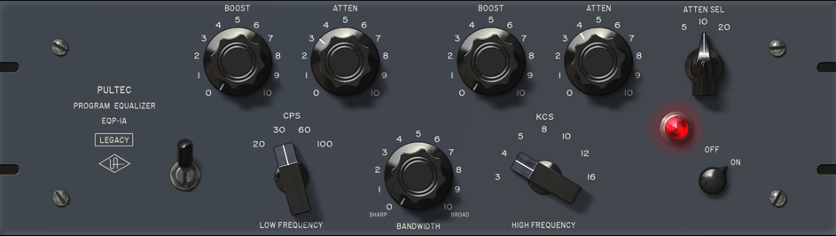

<strong>EQ is THE most important tool in mixing and mastering.</strong> Your ability to mix great sounding tracks will come down to how well you understand the frequencies shaking people's eardrums and how to make those vibrations feel good.  Most of the time you can make sounds better using EQ. In this article we will talk about the different types of EQs, how you use them, and some of the best EQs ever invented (including a freebie you should download today).

A quick word of advice. Once you understand the power of EQ you might be tempted to "fix" things in the mix rather than doing it right from the start. As I mention in the <a href="https://www.midisequencing.com/music-vs-sound/">Music VS Sound</a> article, this is recipe for pain. When you are setting up your mics, designing a synth patch or choosing samples, try to get it sounding as good as possible without telling yourself you can fix it later. Sometimes this means abandoning ideas entirely. Just know the sooner you find great sound in the process, the better off you'll be.

<h2 >Types of EQ</h2>
In this day and age you can sculpt out frequencies with lazer precision. Despite having that ability, sometimes simpler tools with only a few knobs will ultimately sound better.

<h3 >Shelving EQ</h3>
 Classic Pultec EQP-1A -the Low Frequency acts as a shelving EQ[/caption]

A shelf in EQ is when every frequency above or below a certain point is turned up or turned down. For the most part you won't see or use EQs than only do shelving when mixing, you'll see them more in something like a car stereo where this is one knob for the treble and one for the bass. You will use more capable EQs to create EQ shelves all the time along with the shelf's more extreme cousin, which we'll get to in the high-pass and low-pass filter section.

The EQ pictured above, the Pultec EQP-1A is one of those simple EQs that has some sort of magic sound to it despite not being able to choose exactly what you want.  Another thing that's nice about EQs with just knobs and no visual interface is they force you to use your ears instead of getting duped by your eyes.

<h3 >Graphic EQ</h3>
 

Graphic EQs are simple and limited in use as well but simplicity can turn out some really nice results. On the API 560 pictured above there are 10 frequency "<strong>bands</strong>" to choose from. You can <strong>boost these frequencies </strong>(make louder) or <strong>cut them</strong> (make softer). Looks like what you would have on a stereo and it's basically the same thing but designed better.

In practical mixing usage, graphic EQs are best used as a sweetener, possibly in conjunction with a parametric EQ. Graphic EQs are good for live music where you would want to grab a certain frequency fast and not have to muck around.
<h3 >Parametric EQ</h3>
 

The vast majority of time you will use some version of parametric EQ when mixing. George Massenburg coined the term "parametric eq" in the 1972 AES preprint and later designed the awesome plugin pictured above. What makes a parametric EQ so special is the ability to select essentially any frequency or range of frequency with surgical precision and boost or cut them.

Human hearing ranges from 20 herz on the low end all the way up to 20,000 herz. If you check back to the API 560, there are 10 frequencies options to choose from, so if you wanted to cut only around 400 herz for example, you couldn't do it. Hallelujah, we have parametric EQ!

<h3 >Band Compression</h3>
Technically band compression is a form of compression but functionally it is a form of EQ. If you are just learning the fundamentals of mixing, band compression isn't something you need to try and wrap your head around right now. The basic idea is to turn down a certain frequency range, under certain conditions, in a certain way. One of the most common uses for this is when D'essing.

<iframe src="https://www.youtube.com/embed/k-MBRGvmIWU?start=785" width="560" height="315" frameborder="0" allowfullscreen="allowfullscreen"></iframe>

<h2 >How To Use EQ</h2>
<h3 >High-Pass Filter and Low-Pass Filter</h3>

<strong>A High-Pass filter is placed on the low end of the frequency spectrum</strong> and allows high frequencies to pass through while eliminating the frequencies below entirely. The higher up the frequency spectrum you move a high-pass filter, the thinner the sound will become. High-pass filters are vital for removing unwanted low frequencies that will muddy up a mix, <strong>most times you will want to put a high-pass frequency up to about 80 hz on everything besides bass instruments and low drums</strong>, like kicks, to carve out room for the low frequencies you actually want to hear. Watch this example below.

<iframe src="https://www.youtube.com/embed/k-MBRGvmIWU?start=161" width="560" height="315" frameborder="0" allowfullscreen="allowfullscreen"></iframe>

Not only is a high-pass filter great to put on many instruments, you most likely will want to put one on your entire mix as well, going up to around 30-40 hz. The reason you do this is because, especially with today's soft synths, there might be low frequencies you can't hear that will muddy things up and mess with any compressors or effects you put on your master bus. When you do this use a <strong>LINEAR PHASE EQ. </strong>A linear phase EQ removes the phasing found in normal eqs but can be more processing intensive. If you're not sure if you have one, the <a href="http://www.tokyodawn.net/tdr-vos-slickeq/" target="_blank" rel="noopener">TDR VOS SlickEQ</a> by Tokyo Dawn Labs is a free linear EQ and it is amazing!!!!!! Seriously, download that $h!*.

 

When a bomb explodes next to someone in a movie and the character's hearing is muffled, that is a low pass filter. It might be a little confusing that a low-pass filter filters out high frequencies while a high-pass filter filters out low frequencies....the important word to remember is <strong>PASS. The name of the filter indicates which frequencies you will be able to hear</strong>. If you get confused try to come up with your own naming trick to remember the proper name for what the different filters do.

<iframe src="https://www.youtube.com/embed/E5P5c1InZNk?start=24" width="560" height="315" frameborder="0" allowfullscreen="allowfullscreen"></iframe>

<h3 >Subtractive EQ</h3>
Subtractive EQ is the process of finding crappy frequencies and cutting them out. This works by boosting a narrow band to find the bad stuff then simply turning it down. Looks like this.

<iframe src="https://www.youtube.com/embed/k-MBRGvmIWU?start=414" width="560" height="315" frameborder="0" allowfullscreen="allowfullscreen"></iframe>

Your ability to determine when there are crappy frequencies that need zapping comes with experience. Many engineers will develop an emotional attachment to frequencies. Personally, I hate 2500-3000 hz, they're rotten, harsh, stinkin' frequencies that are like rubbing gravel against my ear drums, I gut em like a fish for fun...On the other hand 4500 hz -5000 hz are my buddies :)

To help guide you in the right direction there are a ton of EQ charts that tell you what frequencies are associated with common adjectives we use to describe sound. This great chart made by <a href="http://www.independentrecording.net/irn/resources/freqchart/main_display.htm" target="_blank" rel="noopener">IndependentRecording.net</a> tells you where different instruments are heard, names of the frequency ranges (ie high mids, sub bass ect.), and the adjectives that describe the frequencies.

 

<h3 >Additive EQ</h3>
Subtractive EQ cuts frequencies and as you've probably guessed, Additive EQ boosts frequencies. Boosting frequencies can sweeten the sound of an element, make it cut through the mix, or simply change the sound. Normally when you are doing additive EQ you'll get better results by boosting with a wider band-width as oppose to the narrow notch that you might use when doing subtractive EQ. Looks like this.

<iframe src="https://www.youtube.com/embed/k-MBRGvmIWU?start=589" width="560" height="315" frameborder="0" allowfullscreen="allowfullscreen"></iframe>

Personally, when I'm doing additive EQ I prefer to use EQs modeled from famous channel strips rather than an EQ with a visualizer. The Helios sounds great for boosting high frequencies for example.

There are two great benefits to using channel strip EQs.
<ol>
 	<li>You have to use your ears. There are only knobs and no visualizer to influence you.</li>
 	<li>Channel strip EQs have distinct sounds that come from their designers well informed choices. Moving these knobs were simply designed to sound good when used.</li>
</ol>
When you are EQing do not rely on your eyes. <strong>Use visual analyzers infrequently</strong>, only when you really need to check something!

<h3 >Soloing EQ VS In the Mix</h3>
In the videos above we only listened to solo'd instruments while EQing. Generally, even though it is more difficult to hear, you will want to EQ your elements while still hearing the entire mix. This isn't a rule, there are no rules, but it is a good method of practice because people don't hear the instruments solo'd, they'll hear the entire mix.

A solo'd instrument might sound completely weird alone while it sounds really good when surrounded by the mix. Different instruments in the mix might fill in strange frequency gaps from something that sounds bad solo'd but good in the mix. The times you would want to solo an instrument to EQ is when you suspect there is a crappy frequency and you want to do some subtractive EQing.

<h2 >More Vital EQ Info</h2>
<h3 >EQ Parameters</h3>
<ul>
 	<li><strong>Frequency</strong> - High, low, mid? You know frequency by now. The literal definition is measured in Herz and it is how frequent the peaks and valley of the sound wave is.</li>
 	<li><strong>Shelf</strong> - Looks like a shelf, as pictured in the High-pass/Low-pass section, it's when all the frequencies above or below will be boosted or cut but not entirely as in a High-pass or low-pass</li>
 	<li><strong>Filter</strong> - When all of the frequencies in a range are taken out</li>
 	<li><strong>Band/Bandwidth/Q/Bell/Trough/Notch</strong> - This is the range of frequencies you are EQing. A wide/broad Q could be from 1000 to 5000 hz or more, and generally you want to boost using a wide Q. A narrow/sharp Q might only be a couple frequencies wide and is generally used in subtractive EQ</li>
 	<li><strong>Boost/Gain - </strong>Making louder</li>
 	<li><strong>Cut/Attenuation</strong> - Making softer.</li>
</ul>
<h3 >Mastering</h3>

When you are starting out, you will be mastering your own tracks. <strong>Most of mastering is EQing</strong>. As mentioned in the High-Pass section, you will want to use a Linear Phase EQ on your master bus to cut out frequencies below 30-40 hz. These frequencies will not benefit you in anyway but can hurt your mix.

When you are using an EQ on the mastering bus you will usually only want to cut or boost 1-2 db, maybe 3. Adding EQ on the master bus is like adding an EQ to every single instrument in your mix. If you find yourself having to do extreme cuts or boosst in mastering, you probably want to go back and fix your mix.
<h3></h3>
<h3 >Loose Ends</h3>
EQing is very situation specific, so presets are useless. I would go so far to say presets will hinder your development as a mixer and suggest you don't bother with them. It will take time to develop a sense of what you can a should do with an EQ, keep at it and you will learn.

You can very easily lose your mind while EQing and make something that sound worse without realizing it. A lot of times your first instincts will be correct. The first bit of EQing you apply will sound as good as you can make the sound but then you start to think, "wellllllll, would if I tried boosting here more. Wellllll maybe I need a sharper cut here....Welllllll..." And you end up with some alien sound that is nowhere near as good as what you did in the first 2 minutes.

Check out what Bruce Swedien says about mixing Billie Jean.

<iframe src="https://www.youtube.com/embed/8OjqM6uHsY4" width="560" height="315" frameborder="0" allowfullscreen="allowfullscreen"></iframe>

One last thing to note, your system, whether it be your room with monitors, or headphones or whatever, will probably boost and cut certain frequencies thus tricking you into thinking you are sculpting a sound one way but it will sound completely different on other systems. Be sure to check your mixes on multiple sources to get an idea of how your system may be deceiving you so you can compensate for it.

Thanks for reading, you might want to check out <a href="https://www.midisequencing.com/mixing-basics-reverb/">Everything You Need To Know About Reverb</a> or <a href="https://www.midisequencing.com/how-to-build-a-home-recording-studio-from-nothing-to-everything/">How to Build A Home Studio From Nothing to Everything</a>.

Here is the full tutorial if you would like to watch it :)

<iframe src="https://www.youtube.com/embed/k-MBRGvmIWU" width="560" height="315" frameborder="0" allowfullscreen="allowfullscreen"></iframe>

