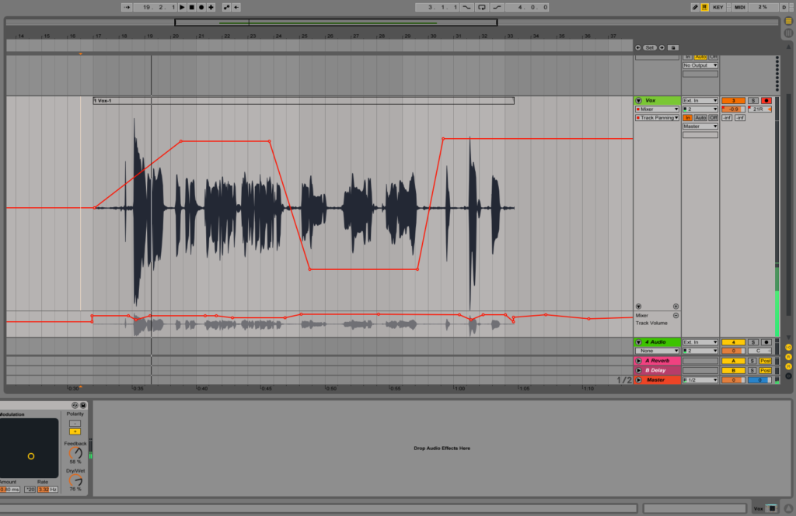
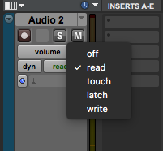
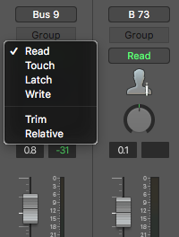
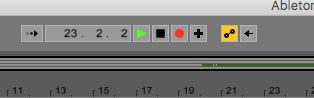
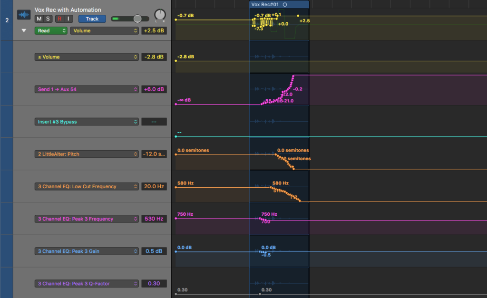

<!-- TODO: Style Fotos -->
<!-- TODO: Fix Links -->

Automation is changing an element in your mix over time. For example, if you want your entire mix to gradually fade out, you would use volume automation on the mix bus to gradually turn the volume down. Other times you might want to add a long delay only to a couple words on your lead vocal, you can do this by either automating a send to a delay or by automating the wet/dry knob on a delay placed as an insert directly on the lead vocals.

The possibilities of automation for mixing and sound design are endless but there are some instances where you will want to be sure to use automation on every mix.

<h2 >Essential Volume Automation</h2>
Volume automation is the most common form of automation and will be used on most every single mix. A mix can live or die by how well you take care of the automation.

<h3 >Lead Vocals</h3>

<iframe src="https://www.youtube.com/embed/ADb5uY6Y_yI?start=56" width="560" height="315" frameborder="0" allowfullscreen="allowfullscreen"></iframe>

Lead vocals will often need a fair amount of volume automation. How to automate the lead vocals depends on the recording of course, but the overall goal is to level the performance and to reduce any harsh sounds. If the vocals were recorded by a world class engineer with amazing outboard gear and an stunning singer who knows how to work a mic, you might not need to do much but that's usually not the situation.

Balancing volume levels with automation rather than just compression will give more precise and better overall results. By honing in the vocal with volume automation first, you give your compressors a better shot to do their job well across the vocal. In the end, you'll find the vocal mix is more natural and balanced overall.

Volume automation on a vocal also gives you the chance to duck any garbage sounds like harsh s's, bad breath sounds, or other background noise mucking with the vibe. Spending time to ensure the lead vocal, the track people listen to the closest, is immaculate, is always time well spend, as demonstrated in the time-stamped video above.

When it comes to treating background vocals, there is no reason to go through every single track, turning down the bad 's's or evening them out with volume automation, that is the perfect time to use compressors and D'essors to get results.

<strong>After you have automated a parameter, such as the volume fader, the automation has taken control over that parameter. If you want to adjust volume of an entire track after adding automation, you can do so with a gain plugin, vca, or busing to an aux track. As demonstrated here. </strong>

<iframe src="https://www.youtube.com/embed/ADb5uY6Y_yI?start=220" width="560" height="315" frameborder="0" allowfullscreen="allowfullscreen"></iframe>

<h3 >Mixbus Automation</h3>
It is common in both mixing and mastering to add slight volume changes for different sections of a piece of music. Most often you will see that mixing engineers turn down the volume of a track sometime before the chorus and then turn the volume back to unity (0 db) at the chorus for impact. Normally it is not a change of more than a db or two but these subtle variations bring life to the mix.

<h2 >The Automation Modes</h2>

<iframe src="https://www.youtube.com/embed/ADb5uY6Y_yI?start=288" width="560" height="315" frameborder="0" allowfullscreen="allowfullscreen"></iframe>

If you only ever draw in automation using a pencil tool then "Read Mode" is the only automation mode you'll ever need. Read mode ensures that your DAW is actually reading the automation and moving your knobs and faders according to the automation data there. When you want to record in automation on the fly, as the track is playing, then you'll want to jump into either touch or latch mode. (Not necessary in Ableton or FL studio, note is listed below).

 

 

An automation mode is basically record enabling automation. <strong>When you are in Latch, Touch or Write mode, you do not need to actually press record to add automation, just press play.
</strong>

I strongly recommend you <strong>do not </strong>use Write mode for recording automation. This mode will overwrite any parameters that have been automated with the settings of the parameter during playback.

The main difference between Latch and Touch modes is that Touch mode will return the parameter back to where it started before recording automation while Latch mode will stay where you leave it. See above video for demonstration.

If you had track that was panned center but at a certain point you wanted it to go left then return to center, Touch mode would make this easier to achieve. If you wanted the track to pan left and stay there, then Latch mode is the better option.

Special note: <strong>Ableton Live and FL Studio don't have automation modes</strong> t<strong>o record in automation.</strong> You can record in automation by pressing record and simply moving a parameter. In FL studio make sure you create a new pattern to record automation to. In Ableton make sure you have enabled the button at the top with two circles diagonally positioned is enabled.

Ableton automation recording functions like touch mode automation.

<h3 >Writing Automation With a Midi Controller</h3>
It is much more fun to automate with an actual knob or fader than flailing your mouse around like you're having arm spasms. Albeton makes assigning midi controllers to parameters stupidly easy. Click the midi button, click a parameter, move something on the midi controller, click the midi button again, and you're done. (Video has no sound).

<iframe src="https://www.youtube.com/embed/1Fa0wTIyyJw" width="560" height="315" frameborder="0" allowfullscreen="allowfullscreen"></iframe>

Setting up a midi controller to control track and plugin parameters in Logic is a bit more complicated but luckily for all y'all, I made a tutorial about it embedded right here.

<iframe src="https://www.youtube.com/embed/kklqArrdHk8" width="560" height="315" frameborder="0" allowfullscreen="allowfullscreen"></iframe>

Controlling parameters with a midi controller is not necessary and a lot of times it is easier to just open the plugin, change the track into Touch or Latch mode, press play, and drag the parameter you want to change with your mouse.

Adding the ability to control plugin parameters or synth patch parameters with a midi controller can make for a more musical experience where you might move a control, perform with the synth and maybe have a happy accident. Try both methods, see what you dig.

<h2 >Automating Effects</h2>
 

By now, if you've watch the automation videos above, you've seen the power of automating effects on a track. Sometimes to achieve a certain result you might want to automate a parameter of an effect inserted directly on your track while other times you will want to automate a send to a certain effect.

For example, if you wanted to filter a certain track and have the filter gradually open up, you will want to insert an eq or filter directly on your track and then add the automation. On the other hand, if you want to add more reverb to a certain word or section, it's better to set up your reverb on a send and automate the send. If you don't know how to set up a reverb on a send or want to learn more about classic reverbs, <a href="https://www.midisequencing.com/mixing-fundamentals-reverb/">check out this article</a>.

Delays are typically set up on a send rather so multiple elements can be sent to the same delay.
<h3 >Full Video</h3>
There are really endless possibilities when it comes to automation. If you have any questions or comments, please leave them below. Here is the full video and time stamps of what is inside, demonstrating automation.

- <a href="https://www.youtube.com/watch?v=ADb5uY6Y_yI&amp;t=58s#">0:39</a> - Example, watch the automation
- <a href="https://www.youtube.com/watch?v=ADb5uY6Y_yI&amp;t=58s#">0:56</a> - Automate the Volume of Lead Vocals
- <a href="https://www.youtube.com/watch?v=ADb5uY6Y_yI&amp;t=58s#">1:40</a> - Turning up the "over and over"
- <a href="https://www.youtube.com/watch?v=ADb5uY6Y_yI&amp;t=58s#">2:45</a> - Turn Down your "S" and your breaths with automation!
- <a href="https://www.youtube.com/watch?v=ADb5uY6Y_yI&amp;t=58s#">3:40</a> - You can't use your volume faders or other parameters after adding automation without redrawing or recording new automation.
- <a href="https://www.youtube.com/watch?v=ADb5uY6Y_yI&amp;t=58s#">4:02</a> - How to control the volume of a track after you've done automation
- <a href="https://www.youtube.com/watch?v=ADb5uY6Y_yI&amp;t=58s#">4:48</a> - Automation Modes (Touch and Latch, don't use write)
- <a href="https://www.youtube.com/watch?v=ADb5uY6Y_yI&amp;t=58s#">5:10</a> - Writing Touch Automation. Touch mode jumps back to where you started
- <a href="https://www.youtube.com/watch?v=ADb5uY6Y_yI&amp;t=58s#">5:40</a> - Writing Latch Mode Automation. Latch mode stays where you leave it.
- <a href="https://www.youtube.com/watch?v=ADb5uY6Y_yI&amp;t=58s#">5:48</a> - Automating your Sends.
- <a href="https://www.youtube.com/watch?v=ADb5uY6Y_yI&amp;t=58s#">6:20</a> - Automating a filter
- <a href="https://www.youtube.com/watch?v=ADb5uY6Y_yI&amp;t=58s#">6:40</a> - How to automate your panning
- <a href="https://www.youtube.com/watch?v=ADb5uY6Y_yI&amp;t=58s#">7:08</a> - Put Back into Read Mode to hear automation, and stop writing

<iframe src="https://www.youtube.com/embed/ADb5uY6Y_yI?ecver=1" width="560" height="315" frameborder="0" allowfullscreen="allowfullscreen"></iframe>
