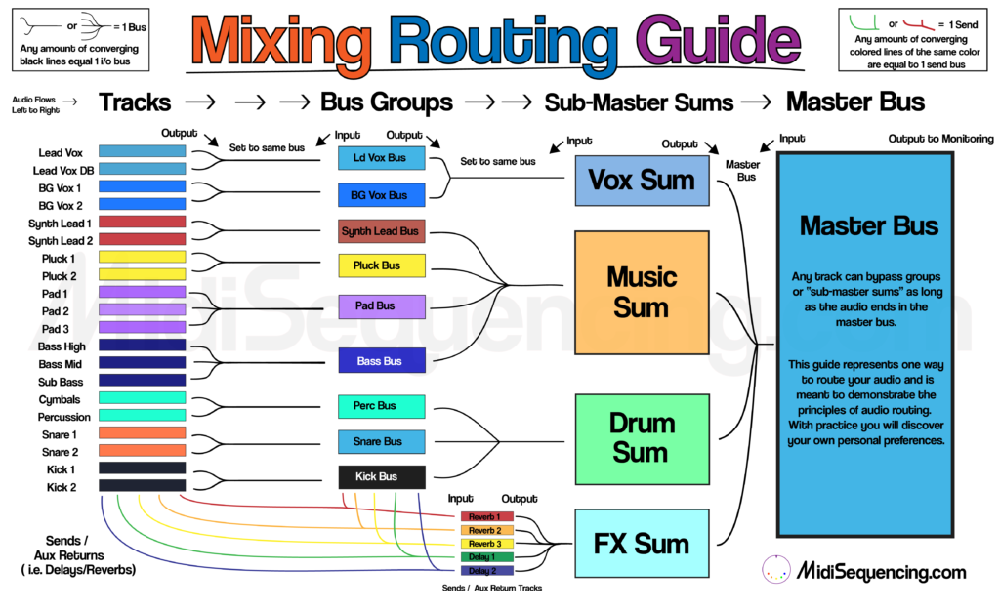
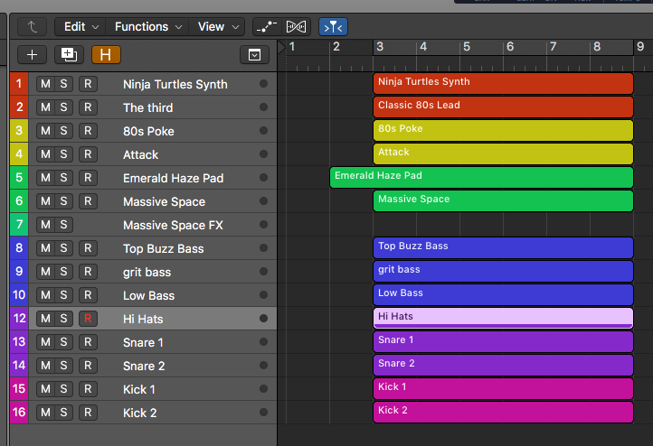
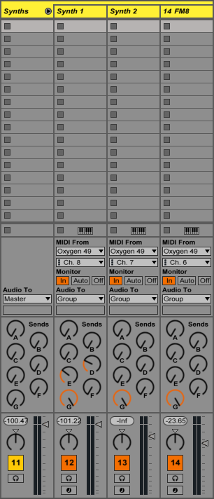

<!--  -->
<!-- [mix guide]: ../media/Routing-Audio-1-1024x626.png -->

Mixing/producing will be much easier when you understand how to properly set up your audio routing and all of your wildest dreams will come true. If you've made some tracks without a good routing scheme then you've felt the pain and difficulty of balancing your mix when the instruments start piling up. When you start adding <a href="https://www.midisequencing.com/mixing-fundamentals-automation/" target="_blank" rel="noopener">automation</a> to elements and want to make some major mix adjustments then you really can start to lose control of the mix and your melon in the process.
<!-- TODO: Link to automation -->
This article will show you that, whether you have 10 tracks or a 1000 tracks, if you set up your routing right you'll be able to control your mix with ease.

Note: These concepts work for all DAWs, live mixing applications, foley or whatever you're mixing but the exact names/methods can vary a bit and they will be addressed as much as possible.

Another Note: Although all video embeds look the same, <strong>they are time stamped to play at the relevant section of the article</strong>. The full video tutorial embed is at the bottom of the article.

<h3 >Organize Your Session</h3>
If you are already placing similar track elements next to each other and color coding them, i.e. all the pads are in the middle of the session and the tracks are colored blue, drums are on the bottom and colored purple ect, then keep doing it and skip to the next section. If not, start organizing your shtuff. Should look something like this.

This session isn't big and there isn't a ton to keep track of, but I always prefer to keep my tracks organized right from the beginning. I think the impulse for us as creative people is to create tracks and get to the fun part of making sounds as fast as possible, leaving the organizational problems to future us. It's fine to do that as you're building a track, if it works for you, but eventually you have stop and get everything into check.

There are no rules on where to specifically put your elements, you can put the basses on the top of your session or the bottom, just do what works for you. Color coding your tracks will make your life so much easier, choose the colors that make sense to you.

<h3 >Master Bus and Sub-Master Sums</h3>
The master-bus or 1-2 bus is the track where all of the sounds in your session will ultimately wind up. <strong>If you mute the master bus you should not hear any sounds.</strong> Any effects applied on the master bus will affect the entire mix.

This next paragraph is like a chunk of raw broccoli, not necessarily entertaining, but good to digest. In your DAW there might already be a track that automatically appears in every session called a "Stereo Out" or "Master" which functions as a master-bus. When I use Logic or Pro Tools as my DAW, I prefer to create a new Aux track and have all my audio routed to that so I have the flexibility of sending the audio back into my session to print my mix on an audio track in the session or re-sample the mix for use in the track. In a DAW like Ableton, you an create any old audio track and set the input of that track to be from the "Master", thus this step isn't necessary.
<h4 >Sub-Master Sums</h4>
"Sub-Master Sums" is a name that I made up (as far as I kn0w) for 3-6 tracks that can control your entire mix. If you turn down all of the sub-master sum tracks, you shouldn't hear any sound. What is the purpose of this extra layer track groupings?

A very standard "sub-master sum" track would be something like a drum sum or what's more commonly called, a drum bus. If you set the output of all your drums, or groups of drums, to one track (aka the drum sum), then you have the ability to turn the volume of all your drums up or down with one fader. Not only can you turn the drums up or down, but you can add effects as inserts such as compression to glue them together or send out to a reverb.

The process for creating these "sub master sums" can be achieved in different ways for different DAWs. In Ableton Live for example, to create sub master sums, you could create new audio tracks, set the input to "no input" and then set the output of your instrument tracks or groups to your newly created audio tracks. In Logic and Pro Tools, this is achieved by creating new aux tracks. Observe below.

<iframe src="https://www.youtube.com/embed/gFptOJ4fKO4?start=103&amp;end=235" width="560" height="315" frameborder="0" allowfullscreen="allowfullscreen"></iframe>

<h3 >Grouping Tracks</h3>
Grouping tracks is basically doing the same thing as creating "sub-master sums" but on a smaller level. Instead of controlling a large group of tracks, like all of your drums, a group might be a bunch of synths you have layered to make your lead synth sound. Fortunately, most DAWs have built in features that make this process really easy.

In Ableton Live for example, you can select a number of tracks, right click, and select "Group Tracks". The result looks like this.

You'll notice that the "Audio To"  (the output) of each synth track goes to "Group". Hey that's swell, now we can turn them all down with one simple fader (the one on the far left) or add effects to all theses synths as a collective section with this "Group" track.

The same time thing can be done in Logic X with what they call "Track Stacks". Both "Groups" in Ableton and "Track Stacks" in Logic at their core, is routing individual tracks to one Aux track. Which is what you'll need to do to achieve the same thing in Pro Tools.

I demonstrate how to do this "manually" (by creating an aux track, instead of a track stack) in Logic X in the video below.

<iframe src="https://www.youtube.com/embed/gFptOJ4fKO4?start=245&amp;end=347" width="560" height="315" frameborder="0" allowfullscreen="allowfullscreen"></iframe>

<h3 >Be Careful With Sends</h3>
If you are<strong> not</strong> familiar with sends, then read this paragraph. Otherwise, skip to the next paragraph so you understand how sends work inside of this routing structure and you don't screw up your entire life. Sends give you the ability to send the audio of a track to another track in order to add some effect.

The important thing to note when you are setting up your send effects is where you output your "aux returns" (the tracks that have the effects on them. aka where you are sending audio to). Sometimes you might want to set the output of a send to the group the affected sound is routed to, like if you are blending in distortion to a certain synth within a layer of synths all routed to one group. Other times you might want to set the output of a send to a sub-master sum, like if it is a reverb you are using on a bunch of different track elements routed to different groups.

If that is confusing, watching this video hopefully will clarify it for you.

<iframe src="https://www.youtube.com/embed/gFptOJ4fKO4?start=351&amp;end=459" width="560" height="315" frameborder="0" allowfullscreen="allowfullscreen"></iframe>

<h3 >You Be You</h3>
This guide is just a guide. After working on numerous projects you will develop your own preferences for how you will want to route your audio to keep control over your mixes.

Eventually, or immediately, <strong>create a template</strong> to reflect your preferences. You set up what you like, or think you'll like, and make adjustments as you go. Having a system of routing in place and built into a template session frees you up creatively and saves so much time.

Do you think I spend time setting up my routing every time I create a new track?

<iframe src="https://www.youtube.com/embed/q_W4Gi5h9P8?start=94&amp;end=96" width="560" height="315" frameborder="0" allowfullscreen="allowfullscreen"></iframe>

<h3 >Full Video Tutorial</h3>

<iframe src="https://www.youtube.com/embed/gFptOJ4fKO4?ecver=1" width="560" height="315" frameborder="0" allowfullscreen="allowfullscreen"></iframe>

