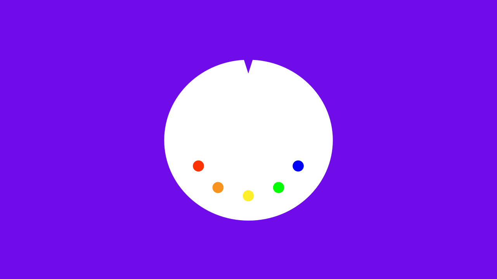

Today quietly marks a huge change for this site. There was no marketing, no promotion and no fanfare; just a dude uploading some files changing a music production blog to a community driven concept.

## How to Actually Learn Music

Let's say you wanted to be the best music maker you could possibly be. Should you go to music school? Probably not.

I say this as a graduate of Berklee College of Music.

For example: Is writing jazz big band arrangements a necessary skill in the 21st century? Not at all. But it was REQUIRED in my major.

Did it help me get better at music? Yes, simply because it was a project that had something to do with music.

Here's a fact of life, if you want to get good at something you have to do it. Sometimes you have to do it a lot. 

## How People Get Off Track

There was a lot of stuff I learned in music school I've never needed to know and a lot of stuff I didn't learn that I needed to learn. What happened when I was confronted with a task I wasn't taught about in school? 

I thought about it. I looked up whatever information I thought could help me. I tried applying that information to my problem. I kept doing that until the job was done.

When the task was finally finished, I could say, with evidence, that I knew how to do that task. 

A big problem with people who are learning to make music is they get some great help from a few tutorials and end up spending too much time in the "looking up information" part. **Information is as valuable as it is useful though.** 

Watching tutorial after tutorial or Dave Pensado tell you about a "neat little plugin" (sorry, love you Dave) can seem beneficial but it's really just a drop in the bucket compared to the ocean of knowledge you get making your own music. 

## The Goal Here

I started this site because I wanted to teach music production. There seemed to be a lot of information missing in schools and online and I wanted to help fill in the gap with articles and tutorials.

After a couple years I realized it wasn't a lack of tutorials that stop people from making better music. It was something else.

There's 2 things you need to get better at making music.
1. To make more music 
2. Honest feedback on the music you create

With this in mind I tried to build the site around these concepts. The projects listed [here](/projects) are designed to push people to seek out quality information and apply it to their own music. Whatever someone's skill level, doing these projects will make them get better simply because they will be creating music.

My hope is that a symbiotic community will thrive on <a href="http://forum.musicsequencing.com" target="_blank">the forums</a> with producers helping other producers. Everyone get's better.

## Why

Why do I care if people make better music? Because I love music. At the end of my life I think I'd be happy knowing I spent it trying to make the world of music a bit better....and I hope to hear some of it while I'm here.

Next step is to see if other people feel the same way.

-Alex

<!-- The whole reason this thing started was my frustration with my schoolin'. I went to Berklee College of Music. A great school, maybe one of the best.. -->

<!-- Berklee College of Music is suppose to be the eminent school of modern music and I think it is, yet there was an ocean of necessary knowledge I never came close to sailing there. -->

<!-- Berklee is a great music school. If you want to by a baddass musician, producer or engineer you can go to Berklee, work your ass off, study with amazing people and do it. But you don't have to go to Berklee to do it either, most baddass music makers don't. -->

<!-- 

The reason the site was started

Search for truth

the way humans learn 

 -->

